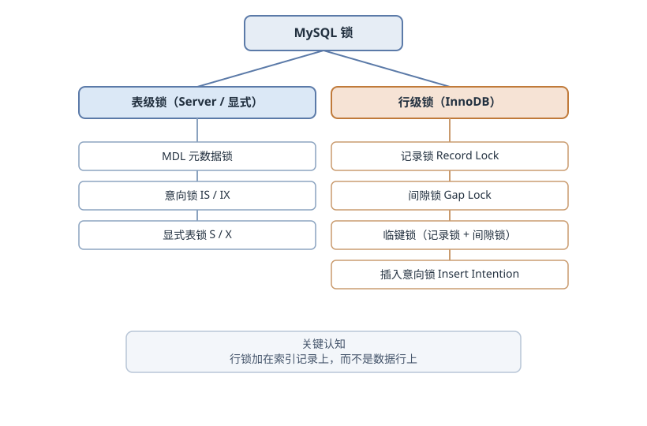
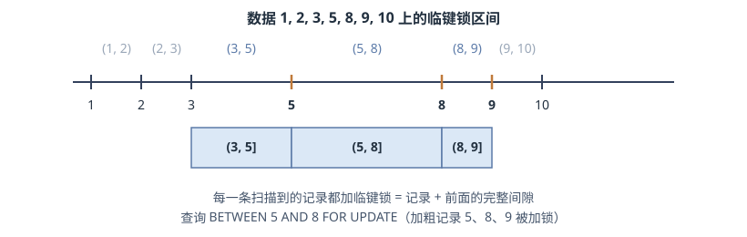
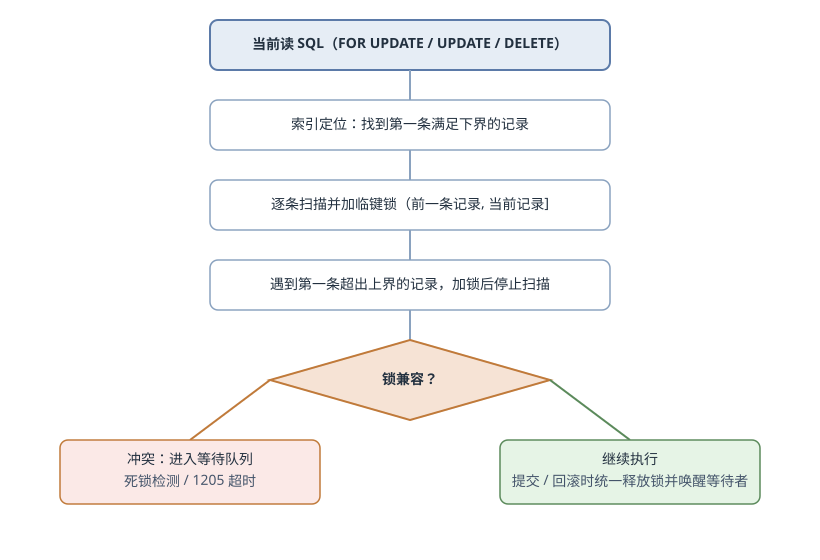

# MySQL 锁

锁是数据库并发控制的核心机制，用于协调多个事务对同一资源的访问。InnoDB 以行级锁为主，同时配合表级锁与间隙锁，在并发与一致性之间取得平衡。

## 锁的基本类型

- **表级锁**：锁住整张表，实现简单但冲突多，适合读多写少的场景。MyISAM 只支持表级锁，InnoDB 也可以显式加表锁。
- **行级锁**：只锁住操作涉及的行，并发度高，适合高并发写入。InnoDB 默认使用行级锁。
- **页级锁**：锁住一页数据，粒度介于表锁和行锁之间，InnoDB 不常用。

## 锁的模式

### 共享锁（S 锁）

- 多个事务可以同时持有同一资源的 S 锁，允许并发读取。
- 持有 S 锁期间，其他事务不能修改该资源。
- 典型语句：`SELECT ... FOR SHARE`（旧语法为 `LOCK IN SHARE MODE`）。

### 排他锁（X 锁）

- 同一资源同一时刻只能被一个事务持有。
- 持有 X 锁期间，其他事务既不能修改，也不能对该资源执行当前读。
- 典型语句：`SELECT ... FOR UPDATE`、`UPDATE`、`DELETE`。

**S / X 兼容矩阵**

|     | S   | X   |
| --- | --- | --- |
| S   | ✔️  | ❌  |
| X   | ❌  | ❌  |

> [!NOTE]
> 普通 SELECT 走快照读，不会因 X 锁而阻塞；矩阵中的“不能读”指当前读。

## 悲观锁与乐观锁

- **悲观锁**：假设并发冲突常见，操作时直接加锁。典型实现是 `SELECT ... FOR UPDATE`、`UPDATE`。
- **乐观锁**：假设并发冲突较少，操作时不加锁，更新时通过版本号或 CAS 校验。典型实现是 `UPDATE ... SET version = version + 1 WHERE version = ?`。

## 意向锁

意向锁是表级锁，用于标记“事务准备在表中的某些行上加锁”，帮助表级锁快速判断是否与行锁冲突。

> [!NOTE]
> InnoDB 在给记录加锁之前，会先对整张表加意向锁。加 S 行锁前加 IS，加 X 行锁前加 IX。

**InnoDB 表级锁兼容矩阵**

|     | IS  | IX  | S   | X   |
| --- | --- | --- | --- | --- |
| IS  | ✔️  | ✔️  | ✔️  | ❌  |
| IX  | ✔️  | ✔️  | ❌  | ❌  |
| S   | ✔️  | ❌  | ✔️  | ❌  |
| X   | ❌  | ❌  | ❌  | ❌  |

> [!NOTE]
> 上表中的 IS、IX、S、X 均为表级锁，用于协调表锁与行锁的关系。

## InnoDB 行锁

行锁不是加在“行”上，而是加在**索引记录**上。查询走哪个索引，锁就落在哪个索引的记录上；如果没有可用索引，InnoDB 会全表扫描，相当于锁住大量记录。

> [!TIP]
> 行锁加在索引记录上；查询没有可用索引时，InnoDB 会全表扫描并锁住大量记录，锁范围会急剧扩大。



### 记录锁（Record Lock）

锁住一条已存在的索引记录，对应 `REC_NOT_GAP`。唯一索引等值查询命中记录时，临键锁会退化为记录锁。

### 间隙锁（Gap Lock）

锁住两个索引值之间的区间，不锁任何记录。它阻止其他事务向区间内插入数据，是防止幻读的关键。

只锁已有记录无法阻止其他事务插入新记录。比如范围查询第一次返回 2 行，提交前别人插入 1 行，再次查询就变成 3 行，这就是幻读。间隙锁把“可能插入新记录的位置”也锁住。

**纯间隙锁出现的场景**

- 唯一索引等值查询未命中记录：只加间隙锁，锁住该值本应存在的区间。
- 普通索引等值查询命中：最后一条命中记录之后的下一条记录加纯间隙锁，防止插入相同值。

> [!NOTE]
> 间隙锁之间互相兼容，不阻止其他事务获取同一间隙的锁；它只与插入意向锁冲突，阻止往间隙里插入数据。

### 临键锁（Next-Key Lock）

临键锁 = 记录锁 + 间隙锁，锁住 `(前一条记录, 当前记录]`。它是 RR 隔离级别下当前读的默认加锁单位，同时阻止插入和修改。

> [!TIP]
> 间隙锁防插入，临键锁 = 记录锁 + 间隙锁，两者共同构成 RR 下防幻读的基础。

**加锁单位退化规则**

- 唯一索引等值命中：只加记录锁，因为记录唯一，不存在插入冲突。
- 范围查询：范围内记录加临键锁，范围外第一条记录也加临键锁。

**范围查询推演**

假设表 `t(id INT PRIMARY KEY)`，已有数据 `1, 2, 3, 5, 8, 9, 10`，执行：

```sql
SELECT * FROM t WHERE id BETWEEN 5 AND 8 FOR UPDATE;
```

扫描过程：

1. 定位到第一条 `id >= 5` 的记录 `5`，它的前一条记录是 `3`，加临键锁 `(3, 5]`；
2. 记录 `8` 满足 `<= 8`，加临键锁 `(5, 8]`；
3. 记录 `9` 是第一条 `> 8` 的记录，加临键锁 `(8, 9]`，扫描结束。



被阻挡的插入：`6`、`7`（会产生幻读），以及 `4`、`8.5`（不在查询范围内，但被相邻间隙顺带锁住，属于过度加锁）。

**不同数据分布下的锁区间**

| 已有记录 | 锁区间 | 说明 |
| --- | --- | --- |
| 1, 4, 7, 10 | `(4,7]`、`(7,10]` | 起点是 7，锁区间恰好覆盖查询边界 |
| 1, 5, 7, 9 | `(1,5]`、`(5,7]`、`(7,9]` | 起点是 5，多锁了查询范围之外的 `(1,5)` |
| 1, 2, 3, 5, 8, 9, 10 | `(3,5]`、`(5,8]`、`(8,9]` | 起点是 5，多锁了查询范围之外的 `(3,5)`；8 是命中记录，必须被锁 |

> [!TIP]
> 间隙锁锁在哪里，不由 SQL 中的数字决定，而由“第一条满足下界的记录”和“第一条超出上界的记录”决定。

### 插入意向锁（Insert Intention Lock）

插入操作先在目标间隙上申请插入意向锁。它与间隙锁冲突，但多个插入意向锁之间互相兼容。

**data_locks 模式对照**

| LOCK_MODE | 含义 |
| --- | --- |
| `X` / `S` | 临键锁（记录 + 前面的间隙） |
| `X,GAP` / `S,GAP` | 纯间隙锁 |
| `X,REC_NOT_GAP` / `S,REC_NOT_GAP` | 纯记录锁 |
| `X,GAP,INSERT_INTENTION` | 插入意向锁 |

### 加锁时机

- **快照读**：普通 `SELECT`，基于 MVCC 读取历史版本，不加行锁。
- **当前读**：读取最新版本并加锁，包括 `SELECT ... FOR UPDATE`、`SELECT ... FOR SHARE`、`UPDATE`、`DELETE`、`INSERT`。

> [!TIP]
> 普通 SELECT 不加行锁，只有当前读（`FOR UPDATE` / `FOR SHARE` / `UPDATE` / `DELETE`）才会加锁。

| 语句 | 类型 | 是否加 InnoDB 行锁 |
| --- | --- | --- |
| 普通 `SELECT` | 快照读 | 否 |
| `SELECT ... FOR SHARE` | 当前读 | S 锁 |
| `SELECT ... FOR UPDATE` | 当前读 | X 锁 |
| `UPDATE` / `DELETE` | 当前读 | X 锁 |
| `INSERT` | 写入 | 插入意向锁、记录锁等 |

> [!NOTE]
> SERIALIZABLE 隔离级别下，若 `autocommit = 0`，普通 `SELECT` 会被自动转换为共享锁读。

### 加锁工作流程

InnoDB 当前读加行锁（`SELECT ... FOR UPDATE` / `UPDATE` / `DELETE` ）的**工作流程**如下：



1. **定位起点**：当前读沿索引定位第一条满足下界条件的记录。
2. **逐条加锁**：从起点开始，对每条扫描到的记录加临键锁 `(前一条记录, 当前记录]`。
3. **边界收尾**：扫描到第一条不满足上界条件的记录时，也为它加临键锁，然后停止。
4. **兼容检查**：如果目标锁与已有锁冲突，事务进入等待队列；InnoDB 同时进行死锁检测。
5. **统一释放**：所有锁在事务提交或回滚时一次性释放，并唤醒等待者。

> [!TIP]
> InnoDB 遵循两阶段锁：加锁分布在事务执行过程中，释放集中在提交或回滚时。长事务 = 长时间持锁。

## 隔离级别与加锁范围

| 隔离级别 | 快照读 | 当前读 | 间隙锁 |
| --- | --- | --- | --- |
| READ UNCOMMITTED | 不加锁，可能读到未提交数据 | 记录锁 | 无 |
| READ COMMITTED | 每条语句生成新快照 | 只锁命中记录 | 基本禁用（外键/重复键检查除外） |
| REPEATABLE READ | 事务内复用同一快照 | 临键锁 | 有 |
| SERIALIZABLE | 自动转为共享锁读 | 加锁 | 有 |

> [!NOTE]
> 间隙锁只在 RR 及以上生效，这也是 RC 并发度更高的原因。RC 下配合 binlog row 格式是常见的生产配置。

> [!TIP]
> RR 是 MySQL 默认隔离级别，也是间隙锁的主要舞台；调成 RC 可以提高并发度，但幻读风险需要业务层自行处理。

## 死锁

死锁的四个必要条件：互斥、持有并等待、不可剥夺、循环等待。InnoDB 默认开启死锁检测，发现循环等待后回滚其中一个事务。

经典示例：

```sql
-- 事务 A
UPDATE accounts SET balance = balance - 100 WHERE id = 1;
UPDATE accounts SET balance = balance + 100 WHERE id = 2;

-- 事务 B
UPDATE accounts SET balance = balance - 100 WHERE id = 2;
UPDATE accounts SET balance = balance + 100 WHERE id = 1;
```

A 持有 id=1 等 id=2，B 持有 id=2 等 id=1，形成死锁。

**错误码区分**

| 错误码 | 含义 | 处理方式 |
| --- | --- | --- |
| 1213 (40001) | 死锁，事务被回滚 | 业务层直接重试 |
| 1205 (HY000) | 锁等待超时（默认 50s） | 优先排查长事务持锁 |

**规避策略**

- 多条记录更新固定顺序，例如按主键排序；
- 事务尽量短，减少持锁时间；
- 让查询走索引，缩小锁范围；
- 不在事务内执行 RPC、慢查询等耗时操作；
- 对 1213 错误做补偿重试。

> [!TIP]
> 死锁无法完全避免，靠固定更新顺序、短事务和重试来降低影响。

## 排查命令

```sql
-- 最近一次死锁的详细信息
SHOW ENGINE INNODB STATUS\G

-- 当前运行的事务
SELECT * FROM information_schema.innodb_trx\G

-- 当前持有的锁（MySQL 8.0）
SELECT * FROM performance_schema.data_locks\G

-- 谁在等谁
SELECT * FROM performance_schema.data_lock_waits\G

-- 简化视图
SELECT * FROM sys.innodb_lock_waits\G

-- 查看 MDL 等待（Waiting for table metadata lock）
SHOW PROCESSLIST;
```

排查思路：先看 `data_lock_waits` 确定“谁在等谁”，再查等锁事务的 SQL 和运行时长；如果事务运行很久未提交，优先处理长事务。`SHOW PROCESSLIST` 中出现 `Waiting for table metadata lock` 时，通常是长事务卡住了 DDL。
