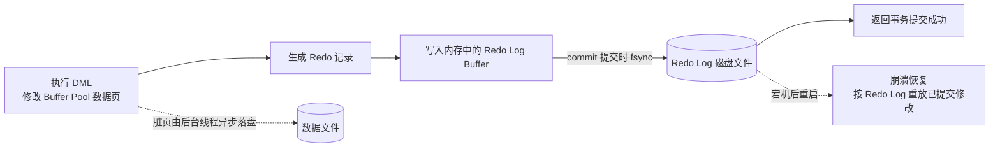

# Redo Log

Redo Log（重做日志）是 InnoDB 存储引擎特有的事务日志，核心职责是保证事务的**持久性（Durability）**：一旦事务提交，对数据的修改就不会因为宕机而丢失。它采用 **WAL（Write-Ahead Logging，预写日志）** 策略，在数据真正落盘之前先把日志写好，崩溃后通过「重做」日志里的修改来完成恢复。Redo Log 与用于回滚 / MVCC 的 Undo Log、以及 server 层负责复制和恢复的 binlog 定位各不相同。

## 脏页

Buffer Pool 是 InnoDB 在内存中开辟的一块页缓存，读写数据都以「页」为单位。执行 `UPDATE` 这类语句时，InnoDB 并不会立刻去改磁盘上的文件，而是先在 Buffer Pool 里把对应的**页副本**改掉。

这样一来，内存里的页和磁盘上对应的页就变得不一致了：内存中的那份带着尚未写回磁盘的新修改。这份**被修改过、但还没落盘的数据页，就叫脏页（Dirty Page）**——它相对磁盘是「脏」的：比磁盘上的数据新，却又不在磁盘上。

InnoDB 允许脏页暂时存在，是为了把零散的写操作攒起来、由后台线程择机批量写回磁盘（刷盘），从而减少磁盘 I/O。但代价是：如果脏页写回之前数据库就宕机，内存中的修改会全部丢失。此时就需要 redo log 出场——崩溃后把已提交事务的修改重新「做」到数据页上，这正是本文 WAL 与 checkpoint 讨论的前提。

可以这样类比：脏页就像先在草稿纸上改好了数字、还没誊写到正式账本；在誊写完成之前，草稿和账本是不一致的。

> [!NOTE]
> 
> 简单来说：**脏页 = Buffer Pool 中被修改过、但尚未写回磁盘的数据页**。它是 redo log、checkpoint、崩溃恢复等机制围绕的核心对象。

## 解决的问题

InnoDB 的数据以「页」（Page，默认 16KB）为单位存放在磁盘上。直接读写磁盘很慢，所以平时数据的读写先在内存中的 **Buffer Pool** 完成：

- 执行 `UPDATE` 时，InnoDB 先修改 Buffer Pool 中对应的数据页；
- 被修改的「脏页」并不会立刻刷回磁盘，而是由后台线程在合适的时机批量落盘，以减少随机 I/O。

这带来一个隐患：如果某个事务**已经提交**，但它修改的脏页还没来得及刷盘数据库就宕机了，内存里的修改会全部丢失——已提交的数据凭空消失，违反持久性。

能不能每次提交都把脏页立刻刷盘？理论上可以，但代价极大：一次提交往往只改几行数据，却要把整个 16KB 的数据页随机写回磁盘，在高频提交场景下性能不可接受。

Redo Log 的思路是把两件事拆开：用「快、顺序追加」的日志先记下这次修改并刷到磁盘；数据页本身继续攒着，由后台慢慢落盘。这样即使宕机，也能靠日志把已提交的修改「重做」回来。

## WAL 预写策略

预写（Write-Ahead）的含义是：在对数据页做最终落盘**之前**，先把描述这次修改的 redo log 记录持久化——**日志先行，数据页靠后**。

Redo Log 的大致流转过程如下：



其中最关键的一步在提交时刻：事务 `commit` 时，InnoDB 会把本次事务产生的 redo log 从内存中的 redo log buffer **刷到磁盘上的 redo log 文件，确认落盘成功后才向客户端返回「提交成功」**。正因为日志先落盘、事务才生效，宕机后才能依靠日志把已提交的修改恢复出来。

> [!NOTE]
> 为什么「先写日志」比「先刷数据页」便宜得多？redo log 是**顺序追加写**，而数据页落盘是**随机写**，顺序写远快于随机写。所以用日志先行换来的持久性，额外开销很小。

## 记录的内容

需要先建立一个认知：redo log 记录的**不是**你执行的那条 SQL 语句本身，也不是修改后的整张表或整个数据页。它记录的是这条 SQL 执行后，磁盘上**某个数据页发生了怎样的修改**——一段定位到表空间、数据页，以及页上哪里被改成了什么的修改描述。

假设执行了：

```sql
UPDATE product SET price = 20 WHERE id = 1; -- 把商品 1 的价格从 10 改成 20
```

这条 SQL 会修改 `product` 表某个数据页上的记录。redo log 里大致就会记下类似下面的内容（**示意**，帮助理解，并非真实的字节级格式）：

| redo log 记录的信息 | 本例子中的内容 |
| --- | --- |
| 修改发生在哪个表空间 | `product` 表所在表空间 |
| 修改发生在哪个数据页 | 该行记录所在的数据页 |
| 定位到页内哪条记录 | 商品 `id = 1` 的记录 |
| 具体改成了什么 | `price` 字段：10 → 20 |

所以**具体记什么，取决于执行了什么业务**。redo log 产生自对数据页的每一次修改：

- `INSERT` → 记「某个数据页新增了一条记录」；
- `UPDATE` → 记「某条记录的某些字段被改成了什么新值」；
- `DELETE` → 记「某条记录被删除」。

一次事务里改了几行、涉及几个数据页，就会产生对应的多条 redo 记录；而「改几行、写成什么值」由业务侧的 SQL 和实际数据决定。

> [!NOTE]
> 与 Undo Log 的方向正好相反：redo log 记的是修改后的结果，用于崩溃后**重做**；undo log 记的是修改前的旧值，用于事务**回滚**和 MVCC 快照读。Undo Log 详细介绍见 [Undo Log](../undo-log/) 章节，其在 MVCC 中的作用见 [MVCC](../../mvcc/) 章节。

## 什么时候刷盘

redo log 先在内存中的 redo log buffer 里累积，事务提交时再一次性刷到磁盘。InnoDB 会把几乎同时提交的多个事务的刷盘**合并成一次 fsync（group commit）**，从而在保证持久性的同时提升吞吐。

> [!TIP]
> 这里的 fsync 表示同步write操作 。

刷盘的激进程度由参数 `innodb_flush_log_at_trx_commit` 控制：

> [!TIP]
> `innodb_flush_log_at_trx_commit` 默认值为 `1`，即每次提交都把 redo log 刷到磁盘，这是保证持久性的关键设置。改为 `0` 或 `2` 可以提升写入性能，但异常宕机时可能丢失最近约 1 秒内已提交的事务。

## Checkpoint（检查点）

redo log 文件组是**循环使用**的：空间有限，写满后会回到开头覆盖旧日志。但旧日志能否被覆盖，取决于它对应的脏页是否已经刷回数据文件——如果脏页还没落盘就把日志覆盖掉，一旦宕机，这些修改将再也无法恢复。

Checkpoint 标记的就是这条「安全覆盖边界」。它用一个 **LSN（Log Sequence Number，日志序列号）** 表示：**该位置之前产生的 redo log，对应的数据页修改都已经刷回磁盘**。于是 checkpoint 之前的日志可以放心覆盖，checkpoint 之后的日志还不能动。

### 什么时候发生 / 推进

- **后台持续刷脏页**：InnoDB 的后台线程（page cleaner）会把 Buffer Pool 中的脏页批量刷回数据文件，刷过某个 LSN 后，checkpoint 就随之推进到该位置；
- **redo log 快写满时被迫推进**：当日志产生速度超过脏页刷盘速度时，redo log 空间不足，InnoDB 会优先强制刷掉最旧的脏页、把 checkpoint 推上去，腾出空间继续写，避免阻塞；
- **脏页比例过高时加速刷**：脏页积累超过阈值（受 `innodb_max_dirty_pages_pct` 等参数影响）会触发更积极的刷盘；
- **正常关闭（shutdown）**：会做一次彻底的 checkpoint，把脏页全部刷完，使下次启动几乎无需恢复。

正常情况下 checkpoint 属于**模糊检查点**：不必等全部脏页落盘，只要把最旧的一批推进过去就能前进；恢复时从 checkpoint 开始重放剩余日志即可。

### 怎么记录

InnoDB 会把最新的 checkpoint 信息（checkpoint 的 LSN 与一个递增的序号）写回 **redo log 文件头部的检查点区域**。每次推进都会写入新的 checkpoint，恢复时读取最近一次成功写入的 checkpoint，从这里开始重放。

### 事务提交后 checkpoint 会立刻变化吗

不会。事务 `commit` 只保证**该事务的 redo log 已经刷到磁盘**，此时它修改的脏页通常还留在 Buffer Pool 里。checkpoint 是否推进，取决于这些脏页**什么时候真正落盘**，而不是事务什么时候提交。因此即使提交非常频繁，只要脏页刷得慢，checkpoint 就停留不动，redo log 空间也会一直被占用。

> [!NOTE]
> checkpoint 与 `innodb_flush_log_at_trx_commit` 关注的是两件事：前者决定「脏页落盘进度、redo log 何时可覆盖」；后者决定「提交时 redo log 刷盘的时机」。提交时刷日志 ≠ 推进 checkpoint。

## 崩溃恢复

数据库宕机重启后，InnoDB 会进入恢复流程：读取 redo log 文件头中最新的 checkpoint，从它开始向后重放日志，把其中记录的对数据页的修改**重新应用一遍（重做）**，使已提交事务的修改不丢失；未提交事务产生的修改本就不该生效，会通过 undo log 回滚掉。


