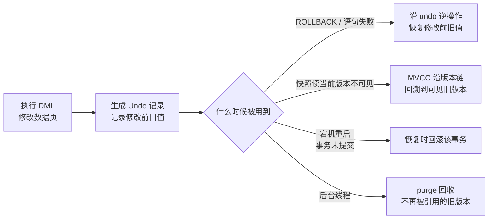

# Undo Log

Undo Log（回滚日志）是 InnoDB 存储引擎的另一类关键日志，与 [Redo Log](../redo-log/) 正好相反：redo 记录修改后的结果，用于崩溃后**重做**；undo 记录修改前的旧值，用于事务**回滚**与 MVCC 快照读。它分别支撑着事务的**原子性（Atomicity）**和一致性读。

## 解决的问题

Undo Log 主要解决三类问题：

**事务回滚（原子性）**

一个事务可能包含多条 DML。如果执行到一半出错，或者我们主动 `ROLLBACK`，已经改过的数据必须恢复原样。Undo Log 在每次修改前先记下旧值，回滚时据此把数据「撤销」回修改前的状态，保证事务「要么全做、要么全不做」。

**MVCC 一致性读**

普通 `SELECT`（快照读）需要读取某个一致的历史版本，而不是最新值。Undo Log 保存了每次修改前的旧版本，快照读在最新版本不可见时，可以沿版本链回溯到可见版本。这部分与 MVCC 读视图配合的细节在 [MVCC](../../mvcc/) 章节详述。

**崩溃恢复中撤销未提交事务**

数据库宕机重启后，redo log 会把日志中的修改重放到数据页上，其中包含尚未提交事务产生的修改。这些「半途而废」的事务本就不该生效，InnoDB 会借助 Undo Log 把它们的修改回滚掉。简单说：**redo 负责「已提交的做回来」，undo 负责「未提交的撤销掉」**。

## 持久化与清理

Undo Log 的记录并不是写在某个专门的「undo 日志文件」里，而是作为**数据页**存放在磁盘上（系统表空间或独立的 undo 表空间），它的读写与普通数据页一样经过 Buffer Pool。

**持久化策略与普通数据页一致，靠 redo log 兜底（WAL策略）**

- 事务执行 DML 时，InnoDB 先在内存中生成 undo 记录（写入 Buffer Pool 中的 undo 页）；
- 对 undo 页的这一处修改，同样会生成 redo log 记录；
- undo 脏页由后台线程和普通脏页一起刷回磁盘；
- 若在刷盘前宕机，redo log 可以把 undo 页恢复回来。

> [!NOTE]
> 事务提交前产生的 undo 记录如果丢了，问题不大——这个事务本来就要回滚，修改也还没生效。真正不能丢的，是**已提交事务遗留下来的 undo**（还要供更早开始的读视图回溯历史版本）。这些 undo 页在提交前就已通过 redo log 持久化，崩溃后可以恢复出来。

**清理策略：purge 延迟回收**

undo 记录不能无限增长。事务提交后，它的 undo 并不会立刻删除——因为可能还有更早开始、仍在执行的事务需要通过版本链读到这些旧版本。后台的 **purge 线程**会持续检查，一旦确认某条 undo 记录不再被任何活跃读视图需要，就把它回收，避免 undo 空间无限膨胀。

> [!TIP]
> purge 由专门的线程执行（可用 `innodb_purge_threads` 配置线程数），undo 页存放在 undo 表空间。**长事务**或**长期不提交的快照读**会让旧版本迟迟无法被清理，是 undo 膨胀、表空间变大的常见原因。

## 记录内容

**逻辑撤销信息，不是物理字节**

redo log 记录「数据页被改成了什么样」，undo log 反过来记录「这次修改之前是什么样」。它面向的是**某一行记录**，保存撤销这次修改所需的信息——旧值、行定位等，并不是对数据页的字节级快照。

它配合行上的隐藏字段 `DB_ROLL_PTR`（回滚指针）工作：每次修改产生的旧版本都由 undo 记录，行上的 `DB_ROLL_PTR` 指向上一条 undo 记录，从而把多个版本串成**版本链**。快照读发现当前版本不可见时，就沿着版本链回溯。

**两类 undo 记录**

| 类型 | 由什么产生 | 记录内容 | 何时可清理 |
| --- | --- | --- | --- |
| Insert Undo Log | `INSERT` | 新插入行的主键等定位信息 | 事务提交后即可 |
| Update Undo Log | `UPDATE` / `DELETE` | 被修改列的旧值、被删行的旧内容 | 无读视图引用后由 purge 回收 |

- **Insert Undo Log**：`INSERT` 产生，记录新插入行的主键等信息，回滚时据此把该行删掉。它对 MVCC 没有价值——新插入的行对其他更早开始的读视图本来就不可见，所以事务提交后就可以被清理。
- **Update Undo Log**：`UPDATE` 和 `DELETE` 产生。`DELETE` 在 InnoDB 中通常是「标记删除」，不会立刻物理移除，undo 保存的是被删行的旧内容；`UPDATE` 保存被修改列的旧值。提交后不能立刻清除，要等服务版本链的读视图消失，由 purge 延迟回收。

**例子（沿用 Redo Log 的商品价格场景，方向相反）**

执行 `UPDATE product SET price = 20 WHERE id = 1`（把商品 1 的价格从 10 改成 20）：

- redo log 记录：「把这条记录的 `price` 改成 20」——用于崩溃后重做；
- undo log 记录：「这条记录修改前的 `price` 是 10」——用于回滚 / 回溯。

| 这条 UPDATE 产生的 Undo 记录 | 内容 |
| --- | --- |
| 作用在哪一行 | 商品 `id = 1` 的记录 |
| 保存的旧值 | `price`：10（修改前） |
| 行定位信息 | 主键、回滚指针等 |

当事务执行 `ROLLBACK` 时，把 `price` 恢复为 10；其他事务快照读若看不到 20 这个新版本，也会沿版本链读到 10。

## 使用时机

Undo Log 的使用时机可以归纳为四种：

1. **事务回滚**：`ROLLBACK`（或单条语句失败的部分回滚）时，按该事务产生的 undo 记录逐条执行逆操作，把数据恢复原样；
2. **崩溃恢复**：重启后 redo log 重放完毕，对没有 commit 标记的事务，用 undo 回滚其修改，保证未提交的修改不生效；
3. **MVCC 快照读**：快照读发现当前版本对读视图不可见时，沿 `DB_ROLL_PTR` 版本链回溯，用 undo 中的旧版本构造可见结果；
4. **purge 清理**：后台 purge 线程回收不再被任何读视图引用的历史版本（存储侧对 undo 的消费）。

## 与 Undo Log 对照

| 维度 | Redo Log | Undo Log |
| --- | --- | --- |
| 记录方向 | 修改后的结果（新值） | 修改前的旧值 |
| 支撑的特性 | 持久性（Durability） | 原子性（回滚）+ 一致性读 |
| 崩溃恢复职责 | 重放已提交事务的修改 | 撤销未提交事务的修改 |
| 存储形式 | 独立的顺序日志文件 | 存放在（undo）表空间中的页 |
| 生命周期 | checkpoint 之后循环覆盖 | 提交后由 purge 延迟清理 |
