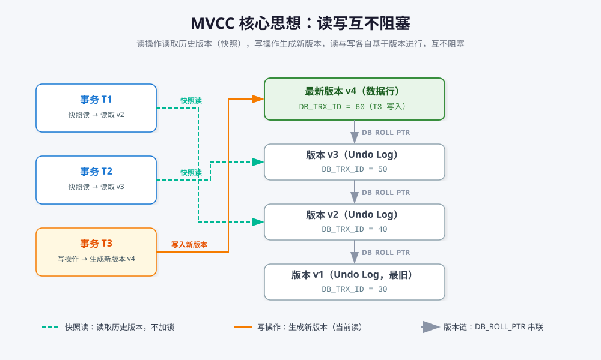
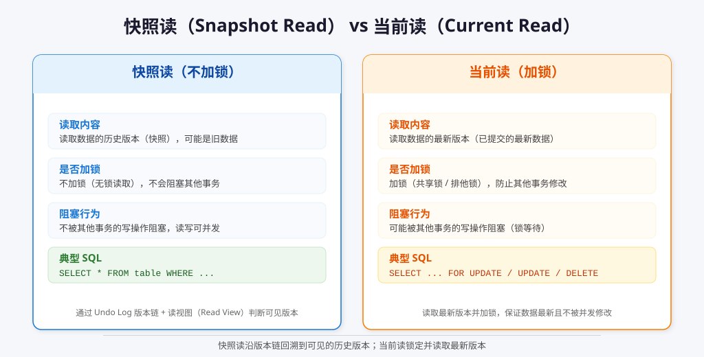
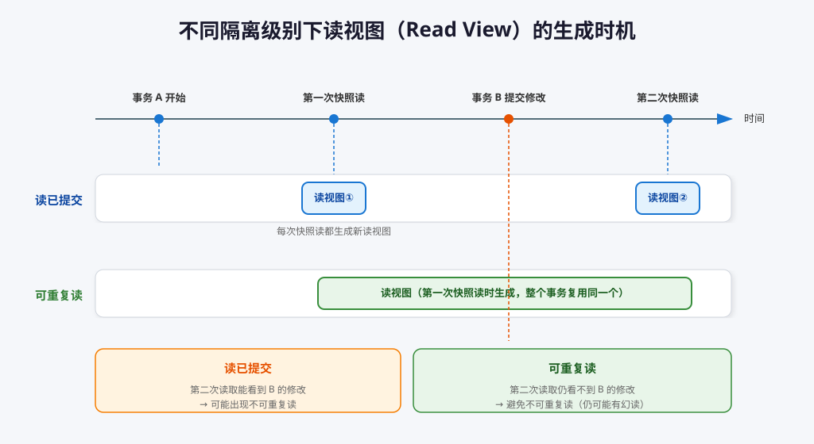
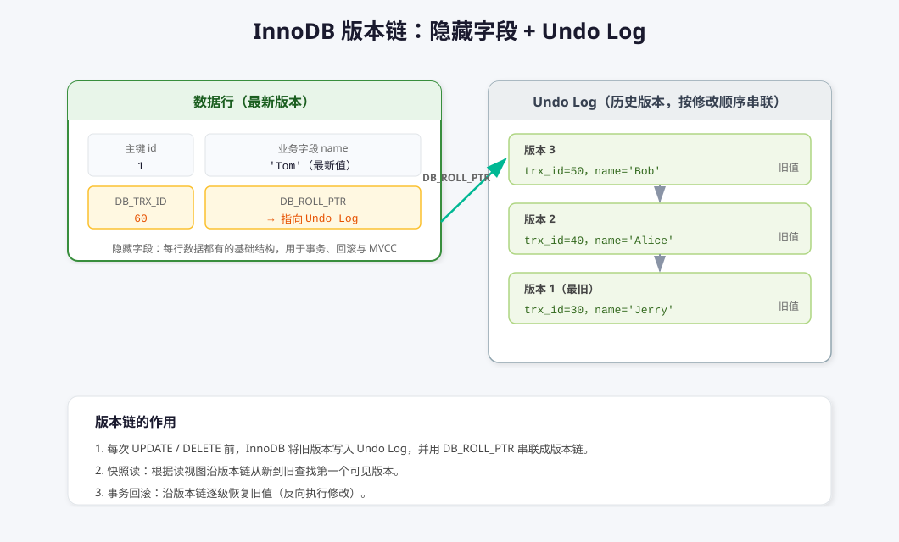
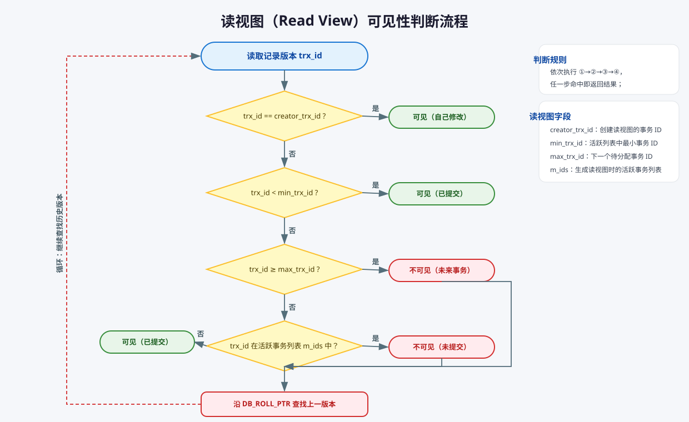

# MySQL MVCC

## 基本概念

MVCC（Multi-Version Concurrency Control，多版本并发控制）是一种数据库并发控制机制。它允许多个事务并发访问数据库而不会互相阻塞，通过为每个事务提供数据的“快照”，实现高效的并发读写。

MVCC 的核心思想是：**写操作产生新版本，读操作读取合适的旧版本**，读与写之间互不阻塞：

## MVCC 的实现原理

MVCC 主要通过两种读操作实现：**快照读（Snapshot Read）** 和 **当前读（Current Read）**。

### 快照读（Snapshot Read）

- 读取的是数据的历史版本（快照），不会被其他事务的写操作阻塞。
- 典型的 SQL 语句：`SELECT * FROM table WHERE ...;`
- 在 InnoDB 中，快照读通过 Undo Log 实现。每条记录都有多个版本，事务根据自己的读视图（Read View）沿版本链找到可见的那个版本。
- 快照读**不加锁**，因此读与读、读与写都可以并发执行。

### 当前读（Current Read）

- 读取的是数据的最新版本，可能会被其他事务的写操作阻塞。
- 典型的 SQL 语句：`SELECT ... FOR UPDATE`、`UPDATE`、`DELETE` 等。
- 当前读会**加锁**（共享锁 / 排他锁），确保读取到的数据是最新的，并且防止其他事务同时修改。

| 对比维度 | 快照读 | 当前读 |
| --- | --- | --- |
| 读取内容 | 历史版本（快照） | 最新版本 |
| 是否加锁 | 不加锁 | 加锁（共享锁 / 排他锁） |
| 是否阻塞 | 不被写操作阻塞 | 可能被写操作阻塞 |
| 典型 SQL | `SELECT` | `SELECT ... FOR UPDATE`、`UPDATE`、`DELETE` |

## MVCC 与事务隔离级别的关系

MVCC 在 InnoDB 中主要用于实现不同的事务隔离级别，尤其是**读已提交（Read Committed）**和**可重复读（Repeatable Read）**。两者的核心区别在于**读视图（Read View）的生成时机**。

**流程描述**：

- 事务 A 在“可重复读”隔离级别下开始，执行第一次快照读时生成读视图。
- 事务 B 修改并提交数据。
- 事务 A 多次读取同一条数据，看到的都是第一次快照读时的数据（不会看到事务 B 的修改）。

而如果是“读已提交”隔离级别：

- 事务 A 每次读取都会生成新的读视图。
- 事务 B 提交后，事务 A 再次读取会看到事务 B 的修改。

### 读已提交（Read Committed）

- 每次快照读都会生成新的读视图。
- 事务每次读取数据时，看到的是最新已提交的数据。
- 可能出现“不可重复读”：同一条数据在同一事务中多次读取，结果可能不同。

### 可重复读（Repeatable Read）

- 事务执行**第一次快照读时**才生成读视图，之后整个事务期间复用同一个读视图（注意：不是事务 `BEGIN` 时就生成）。
- 事务多次读取同一条数据，结果始终一致（除非自己修改）。
- 可以避免“不可重复读”，但仍可能出现“幻读”（需配合间隙锁等解决）。

### 其他隔离级别

- **读未提交（Read Uncommitted）**：不使用 MVCC，直接读取最新数据，可能出现脏读。
- **串行化（Serializable）**：通过加锁实现，MVCC 不再起作用。

---

## MVCC 在 InnoDB 中的实现机制

InnoDB 通过以下机制实现 MVCC：

- 每行数据包含两个隐藏字段：`DB_TRX_ID`（最后修改该行的事务 ID）和 `DB_ROLL_PTR`（指向 Undo Log）。
- 这两个隐藏字段是 InnoDB 表每行数据的基础结构，无论隔离级别如何都会存在，用于支持事务、回滚和 MVCC 等功能。
- Undo Log 保存历史版本数据，支持快照读和事务回滚。
- Undo Log 不是一张用户可见的表，而是 InnoDB 内部集中存储的数据结构。每次数据修改都会生成一条 Undo Log 记录，由每行数据的隐藏字段指向相关 Undo Log。
- 事务快照读时，会生成一个读视图（Read View），决定能看到哪些版本的数据。
- 事务读取数据时，InnoDB 根据读视图和 Undo Log 判断并返回可见的数据版本。

### 隐藏字段与版本链

每条记录（数据行）上都有两个隐藏字段，配合 Undo Log 形成**版本链**：

- **DB_TRX_ID**：记录最后一次修改该行的事务 ID，用于判断该版本对当前事务是否可见。
- **DB_ROLL_PTR**：指向该行上一个版本的 Undo Log 记录，多个版本通过该指针串联成链。
- 版本链方向：**最新版本 → 最旧版本**。当前读读到的是链头（最新值），快照读则沿链回溯寻找可见版本。

### Undo Log

Undo Log 用于保存数据的历史版本，支持快照读和事务回滚。每次数据修改前，InnoDB 会将旧版本写入 Undo Log，事务快照读时可通过 Undo Log 获取历史数据。

Undo Log 集中存储在 InnoDB 系统表空间中，不是用户可见的表。每行数据的 `DB_ROLL_PTR` 字段指向与该行相关的 Undo Log 记录，形成版本链，支持 MVCC 和回滚。

### 读视图（Read View）

读视图是 MVCC 的核心，决定事务能看到哪些数据版本。每次快照读都会用读视图判断数据版本是否可见，如果不可见则沿 Undo Log 查找历史版本。

#### 读视图什么时候生成？

读视图**不是事务开始时生成**的，而是**执行快照读时才生成**（懒加载）：

- **可重复读（Repeatable Read）**：事务执行**第一次快照读**时生成读视图，之后整个事务内**复用同一个读视图**，后续快照读不再生成新读视图。这保证了同一事务内多次读取结果一致（可重复读）。
- **读已提交（Read Committed）**：**每次快照读都重新生成**一个新的读视图。因此事务 B 提交后，事务 A 下一次快照读就能看到 B 的新数据（不可重复读）。
- **当前读不生成读视图**：`SELECT ... FOR UPDATE`、`UPDATE`、`DELETE` 属于当前读，走的是加锁读最新版本，不依赖读视图。
- 如果事务只执行当前读、从不执行快照读（普通 `SELECT`），则该事务**根本不会生成读视图**。

> [!TIP]
> 读视图的生成时机可以理解为：**普通 `SELECT`（快照读）触发**。可重复读下"首次快照读即生成、此后复用"；读已提交下"每次快照读都重新生成"。

#### 读视图包含哪些字段？

读视图主要包含四个字段：

- **creator_trx_id**：创建该读视图的事务 ID。**在生成读视图的那一刻写入，值为当前事务的事务 ID**（即当前事务自己），此后该读视图内固定不变，不会更新。
- **min_trx_id**：生成读视图时，活跃事务列表中最小的事务 ID。
- **max_trx_id**：生成读视图时，下一个待分配的事务 ID。
- **m_ids**：生成读视图时的活跃事务 ID 列表。

其中 `min_trx_id`、`max_trx_id`、`m_ids` 三者也是**在生成读视图的那一刻快照下来**的：它们记录的是"读视图生成瞬间"系统中活跃事务的状态，之后即使其他事务提交或开启新事务，这三个字段也不会变化（读已提交下因每次快照读都重新生成，才会看到变化）。

> [!NOTE]
> **creator_trx_id 何时更新？**
> - 生成读视图时：`creator_trx_id` 被写为**当前事务自己的事务 ID**，用于判断"该版本是否是自己修改的"。
> - 读视图存续期间：`creator_trx_id` 是**固定不变的**，不会随其他事务提交而更新。
> - 重新生成读视图时（读已提交下每次快照读）：会生成一个新的读视图，其 `creator_trx_id` 仍然是当前事务自己的 ID（因为当前事务没变），变化的是 `m_ids`、`min_trx_id`、`max_trx_id` 等活跃事务信息。

判断某个版本是否可见的流程如下：

判断规则（依次执行，命中即返回）：

1. `trx_id == creator_trx_id` → **可见**（自己修改的数据）。
2. `trx_id < min_trx_id` → **可见**（该事务在读视图创建前已提交）。
3. `trx_id >= max_trx_id` → **不可见**（该事务在读视图创建后才开始）。
4. `trx_id` 在 `m_ids` 中 → **不可见**（该事务仍在活跃中，未提交）。
5. 否则 → **可见**（已提交，且不在活跃列表）。

若当前版本不可见，则沿 `DB_ROLL_PTR` 继续向上查找历史版本，重复上述判断，直到找到可见版本或版本链结束。

---

## MVCC 的优缺点与应用场景

### 优点

- **高并发性能**：读写操作并发进行，读操作不会阻塞写操作。
- **数据一致性**：通过快照读和读视图，保证事务读取到的数据一致性。
- **减少锁竞争**：读操作无需加锁，降低锁竞争和死锁风险。

### 缺点

- **空间消耗**：需要维护多个数据版本（Undo Log），占用更多存储空间。
- **实现复杂**：涉及版本链、读视图、Undo Log 等，增加数据库实现复杂度。
- **幻读问题**：在“可重复读”隔离级别下，MVCC 无法完全解决幻读，需要额外加锁（如间隙锁）。

### 应用场景

- **高并发读写场景**：如电商、社交、金融等需要大量并发访问的系统。
- **需要数据一致性但不要求强一致性**：如报表、统计分析等。
- **事务隔离级别为“读已提交”或“可重复读”**：MVCC 能充分发挥作用。

---

**总结：**

- MVCC 通过读视图实现不同隔离级别的数据可见性。
- “可重复读”用同一个读视图，“读已提交”每次生成新读视图。
- 快照读不加锁、读历史版本；当前读加锁、读最新版本。
- 版本链（隐藏字段 + Undo Log）是 MVCC 实现的基础。
