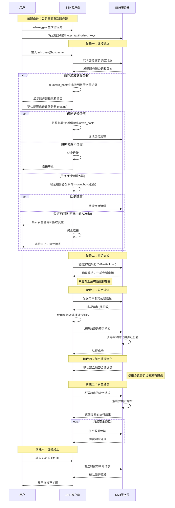
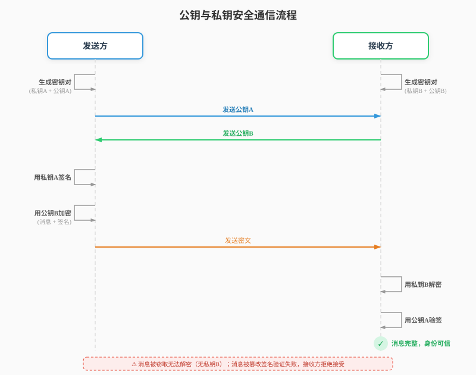

# SSH

SSH (Secure Shell) 是一种网络协议，用于在不安全的网络中安全地访问远程计算机。它通过加密技术确保通信的机密性和完整性。

## 工作流程
这里仅介绍最常见的基于公钥和私钥的 SSH 连接流程：

## 身份验证方式

SSH 通常使用以下方式进行身份验证：

1. **公钥和私钥**: 通过生成密钥对，确保只有拥有私钥的用户可以访问。
2. **用户名和密码**: 提供传统的验证方式，但安全性较低。

SSH 是管理远程服务器和保护网络通信的关键工具，广泛应用于开发、运维和网络管理领域。

## 公钥和私钥

公钥和私钥是非对称加密中的一对密钥，用于确保数据的安全性和完整性.

**公钥作用**: 加密数据、验证数字签名。  
**私钥作用**: 解密数据、生成数字签名。

> [!NOTE]
> 公钥可以公开分发，而私钥必须严格保密(只有私钥能够解密数据)。

公钥和私钥在安全通信中的应用：

