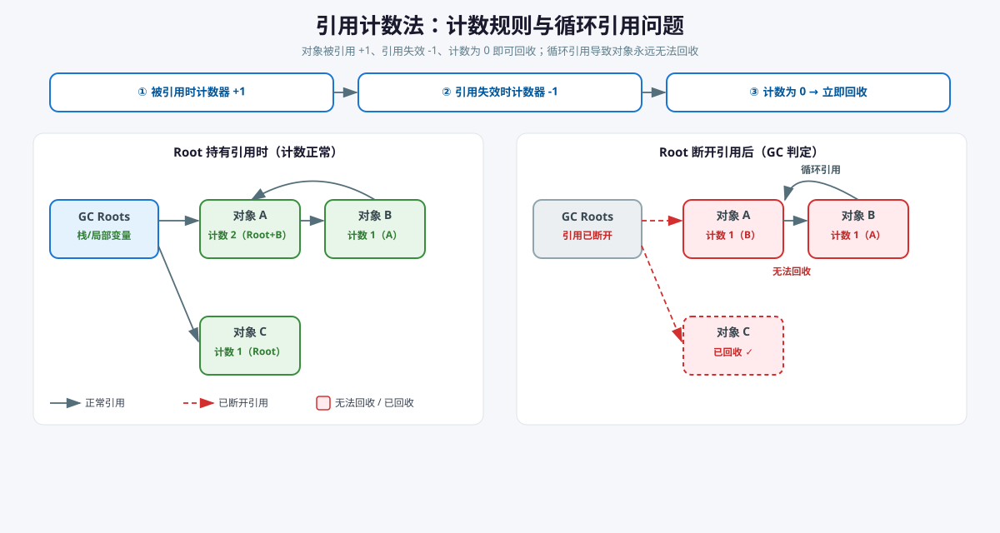
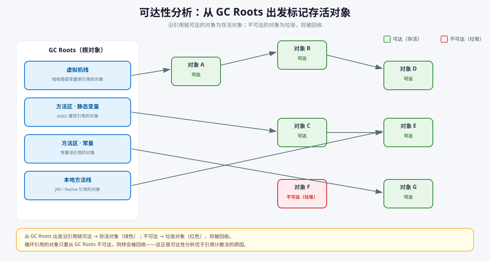
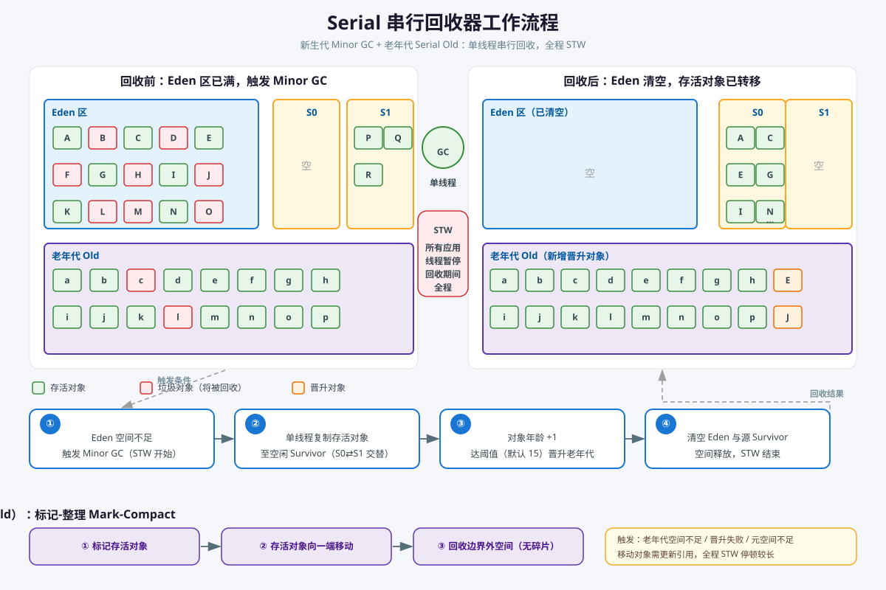
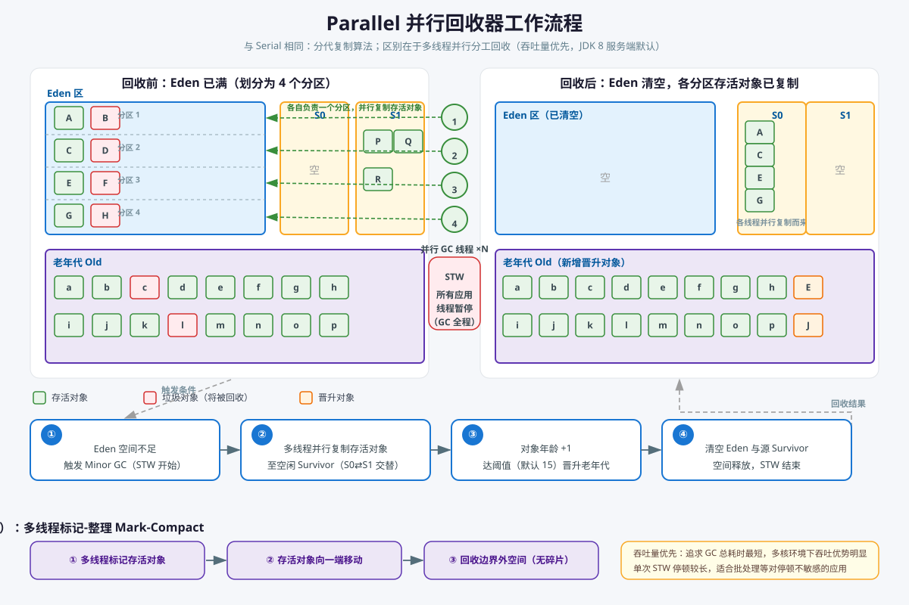
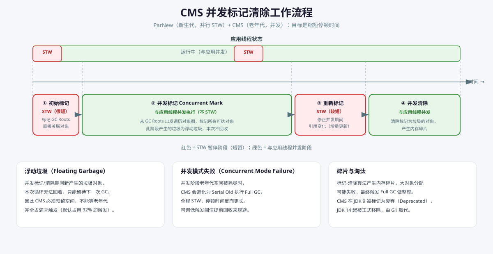
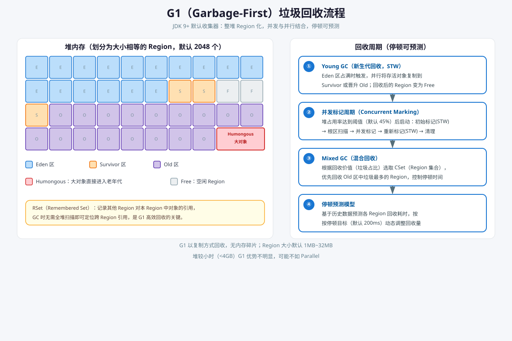
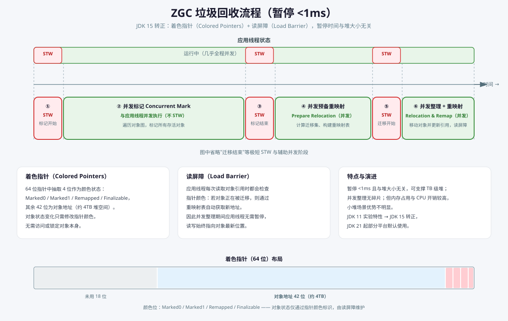

# Java虚拟机

JVM全称Java Virtual Machine（Java虚拟机），它能够执行Java字节码。JVM是Java平台的一部分，负责将Java字节码转换为机器代码，并在运行时管理内存和资源。

主要功能包括:

- 加载和执行Java字节码
- 内存管理和垃圾回收
- 优化热点代码


常见JVM实现:

| 实现名称  | 提供方         | 主要特点                                                                                                      |
| --------- | -------------- | ------------------------------------------------------------------------------------------------------------- |
| HotSpot   | Oracle/OpenJDK | 默认JVM，拥有高效的JIT编译器（C1/C2）、成熟的GC策略与调优工具，社区广泛支持                                   |
| OpenJ9    | Eclipse基金会  | 启动快、内存占用低、可扩展性好，适合云环境与微服务，重视容器内资源友好性                                      |
| GraalVM   | Oracle         | 多语言运行时（JavaScript、Python、Ruby等）、Graal JIT与Native Image，便于构建原生镜像                         |
| Azul Zing | Azul Systems   | 商业低延迟JVM，集成C4垃圾回收，针对延迟敏感的金融级应用优化，提供长期支持                                     |
| JamVM     | GNU            | 轻量级JVM，启动快、内存脚印小，适合嵌入式设备或教学场景，支持Class文件动态加载                                |
| Avian     | 开源社区       | 极简JVM设计，适用于资源受限的系统与即时编译，便于裁剪为嵌入式或移动平台专用版本                               |
| 龙井      | 阿里巴巴       | 基于OpenJDK的企业级JVM，增强GC与JIT优化、容器友好调度、提供运行时诊断与可靠性保障，适合云原生与大规模服务场景 |

## 类加载子系统

类加载子系统负责从文件系统或网络中加载Java类文件，并将其转化为Java虚拟机可以使用的Java类。类加载主要涉及以下步骤:

### 加载 Loading

加载阶段, JVM从各种来源中获取类的二进制字节码, 并将其读入内存中, 创建对应的`Class`对象。

| 对象 | 创建时机 | 存储位置 | 说明 |
|------|----------|----------|------|
| **InstanceKlass** | 加载阶段（解析 class 文件时） | 方法区/元空间 | HotSpot 内部类元数据结构，JVM 自己使用，不对外暴露，包含字段、方法、常量池等 |
| **Class对象（java.lang.Class）** | 加载阶段（与 InstanceKlass 关联） | 堆内存 | 类的运行时镜像（mirror），与 InstanceKlass 绑定，用于反射访问 |

**字节码的常见来源包括：**

- 磁盘上的本地JAR、WAR、class等文件
- 网络资源（通过HTTP、FTP等协议获取）
- 动态生成的字节码（运行时通过反射、CGLIB等工具动态生成的二进制数据）
- 其他存储介质（数据库、压缩文件等）

JVM使用 **类加载器（ClassLoader)** 来完成加载工作，主要有三种内置的类加载器：

| 加载器          | 实现       | 加载路径             | 父加载器    | 用途                   |
| --------------- | ---------- | -------------------- | ----------- | ---------------------- |
| **Bootstrap**   | C++        | `$JAVA_HOME/lib`     | 无          | 加载JDK核心类库        |
| **Extension**   | Java       | `$JAVA_HOME/lib/ext` | Bootstrap   | 加载JDK扩展库          |
| **Application** | Java       | CLASSPATH            | Extension   | 加载应用程序和第三方库 |
| **Custom**      | 用户自定义 | 自定义               | Application | 特殊加载需求           |

#### 双亲委派机制

类加载器采用双亲委派机制（Parent Delegation Model）来加载类，确保核心类库的安全性和稳定性。


**工作原理：**

1. **自下而上委派**：子加载器收到类加载请求时，先委派给父加载器
2. **自上而下加载**：父加载器尝试加载，如果找到则返回；未找到则让子加载器加载
3. **保证优先级**：确保核心库（java.lang等）由启动类加载器加载
4. **防止重复加载**：同一个类只会被加载一次

**双亲委派的好处：**

- 避免类的重复加载
- 保护核心库（防止覆盖）
- 建立类加载的优先级顺序
- 增强JVM的安全性

### 链接 Linking

链接是类加载过程中的第二阶段，包括验证、准备、解析三个步骤。

**验证（Verification）**

确保类文件符合JVM规范。包括：
- 文件格式验证：魔数`0xCAFEBABE`、版本号、常量池
- 字节码验证：指令合法性、栈深度校验
- 类型安全验证：方法覆写、访问权限检查

**准备（Preparation）**

为类的静态变量分配内存并初始化为默认值（int → 0, boolean → false, object → null）。

**解析（Resolution）**

将常量池中的符号引用转换为直接引用。过程如下：

```
符号引用 → 验证符号实体存在性 → 查找对应的类/方法/字段 → 直接引用（内存地址）
```

常见转换类型：
- 类引用：`CONSTANT_Class` → instanceKlass指针
- 方法引用：`CONSTANT_Methodref` → Method指针
- 字段引用：`CONSTANT_Fieldref` → 字段偏移量

解析时机：大多数JVM采用**懒惰解析**，即首次使用时才解析符号引用

### 初始化 Initialization

初始化是类加载的最后阶段，执行类构造器方法（`<clinit>`），初始化静态变量和执行静态代码块。

## 执行引擎

### 解释器

解释器是JVM中执行字节码最直接的方式。它逐条读取字节码指令，解析其含义，并调用相应的本地方法来执行指令。

**工作原理：**

- 逐行解释和执行字节码
- 边解释边执行，无需等待编译
- 优点是启动速度快，但执行速度较慢
- 适合执行频率较低的代码

**缺点：**

- 执行效率低，因为每次都需要解释
- 对于热点代码（频繁执行的代码）效率很差

### 即时编译器 JIT

即时编译器（Just-In-Time Compiler）是JVM性能优化的关键。JIT将热点代码动态编译为本地机器码，显著提高执行速度。

**工作原理：**

1. JVM持续监控代码执行情况，统计热点代码（频繁执行的代码段）
2. 当代码执行次数达到阈值时，触发JIT编译
3. 将字节码编译为本地机器码并缓存
4. 后续执行直接调用本地机器码，无需重新解释

**编译级别对比：**

| 特性             | C1编译器       | C2编译器      |
| ---------------- | -------------- | ------------- |
| **编译速度**     | 快（毫秒级）   | 慢（秒级）    |
| **编译代码质量** | 一般           | 优秀          |
| **优化程度**     | 轻量级         | 深度          |
| **适用场景**     | 短期热点代码   | 长期热点代码  |
| **编译阈值**     | 1000-5000次    | 10000-20000次 |
| **何时启动**     | 第一次达到阈值 | 代码继续热后  |

**主要优化技术：**

| 优化技术                            | 说明                                                                 | 主要作用                       |
| ----------------------------------- | -------------------------------------------------------------------- | ------------------------------ |
| 方法内联（Inline）                  | 将小方法直接插入调用处，减少方法调用和栈操作的开销                   | 减少调用开销，提升执行速度     |
| 逃逸分析（Escape Analysis）         | 分析对象是否会逃逸到方法/线程外；若不逃逸可在栈上分配或进行标量替换  | 减少堆分配，降低GC压力         |
| 分支预测优化（Branch Prediction）   | 基于静态或运行时信息优化条件分支的生成与布局，减少错误预测带来的成本 | 降低CPU分支错预测和流水线冲刷  |
| 循环展开（Loop Unrolling）          | 展开循环体以减少循环判断和分支次数，配合其他优化（向量化、指令重排） | 提高吞吐量，减少循环开销       |
| 死代码消除（Dead Code Elimination） | 移除在运行时不会被执行或不影响结果的代码片段                         | 减少代码体积，提升后续优化效果 |

### 垃圾回收器 GC

垃圾回收器（Garbage Collector，简称GC）是JVM中负责自动内存管理的组件。它能够在程序运行过程中，自动检测哪些对象已经不再被引用，并释放这些对象所占用的内存空间，从而避免内存泄漏和手动管理内存的复杂性。

#### 对象引用

对象引用是Java中一个重要概念，它决定了对象在内存中的生命周期和垃圾回收时机。Java提供了四种引用类型，强度从强到弱分别为：强引用、软引用、弱引用、虚引用。

| 引用类型   | 回收时机   | GC时回收 | 内存不足时回收 | 典型用途              |
| ---------- | ---------- | -------- | -------------- | --------------------- |
| **强引用** | 无引用时   | ✓        | ✗              | 正常对象引用          |
| **软引用** | 内存不足时 | ✗        | ✓              | 缓存                  |
| **弱引用** | 下次GC时   | ✓        | ✓              | 临时关联、WeakHashMap |
| **虚引用** | 对象回收前 | ✓        | ✓              | 对象回收通知          |

##### 强引用

通过`new`关键字创建的对象引用，是Java中最常见的引用类型。

**特点：**

- 只要强引用存在，对象就不会被垃圾回收
- 即使JVM内存不足而抛出OutOfMemoryError，也不会回收强引用指向的对象
- 强引用是导致内存泄漏的主要原因

**示例：**

```java
String str = "hello";  // 强引用
Object obj = new Object();  // 强引用
```

##### 软引用

通过`SoftReference`类创建，表示对象在内存充足时不会被回收，内存不足时才会被回收。

**特点：**

- 适合用于实现缓存（如图片缓存、数据缓存）
- 内存压力大时会被回收，内存充足时保留
- 一般不会导致OutOfMemoryError

**示例：**

```java
SoftReference<String> softRef = new SoftReference<>("hello");
String str = softRef.get();  // 获取对象，如果被回收则返回null
```

**应用场景：** 缓存中间结果、浏览器缓存、图片加载缓存

##### 弱引用

通过`WeakReference`类创建，表示对象只能生存到下一次垃圾回收。

**特点：**

- 下一次GC执行时，弱引用指向的对象必定被回收（无论内存是否充足）
- 适合用于临时性的关联关系
- 常用于实现WeakHashMap等数据结构

**示例：**

```java
WeakReference<String> weakRef = new WeakReference<>("hello");
String str = weakRef.get();  // 可能返回null（如果对象已被回收）
```

**应用场景：** 缓存键、对象池管理、事件监听器回调

##### 虚引用

通过`PhantomReference`类创建，对象回收时会收到一个系统通知。

**特点：**

- 虚引用无法获取对象实例（`get()`总是返回null）
- 必须配合`ReferenceQueue`使用
- 用于在对象被回收前进行清理工作
- 最弱的引用类型，不会影响对象的生命周期

**示例：**

```java
ReferenceQueue<String> queue = new ReferenceQueue<>();
PhantomReference<String> phantomRef = new PhantomReference<>("hello", queue);
// 对象被回收时，phantomRef会被加入queue

String str = phantomRef.get();  // 总是返回null
```

**应用场景：** 对象回收前的清理操作、Native资源释放、堆外内存回收

##### 引用队列

`ReferenceQueue`用于在软引用、弱引用、虚引用指向的对象被回收时接收通知。

**工作流程：**

1. 创建引用时关联一个ReferenceQueue
2. 当对象被回收时，引用对象会被加入队列
3. 通过`poll()`或`remove()`获取被回收的引用

**示例：**

```java
ReferenceQueue<String> queue = new ReferenceQueue<>();
WeakReference<String> ref = new WeakReference<>("hello", queue);

// GC后
Reference<?> recovered = queue.poll();  // 如果对象被回收，返回ref
if (recovered != null) {
    System.out.println("对象已被回收");
}
```

#### 垃圾识别

垃圾识别的核心问题是判断**哪些对象可以被回收**。常见的识别策略有两种：**引用计数法**与**可达性分析**，现代 JVM（HotSpot）全部采用后者。

##### 引用计数法

引用计数法（Reference Counting）为每个对象维护一个**引用计数器**：每当有新的引用指向该对象时计数器 +1，每当引用失效时计数器 -1，当计数器降为 **0** 时对象即可被回收。

**计数规则：**

1. 对象被新引用指向 → 计数器 +1
2. 引用失效（变量置 null、超出作用域等）→ 计数器 -1
3. 计数器为 0 → 对象可立即回收

**示例：**

```java
// 引用计数法伪代码：计数规则
class RefCountObject {
    int refCount = 0;

    void addRef()  { refCount++; }          // 被引用：+1
    void release() {                        // 引用失效：-1
        if (--refCount == 0) {
            collect();                      // 计数为 0，立即回收
        }
    }
}

// 循环引用问题：A 引用 B，B 引用 A
class Node { Node next; }

Node a = new Node();
Node b = new Node();
a.next = b;   // b.refCount = 1
b.next = a;   // a.refCount = 1
a = null;     // 外部引用断开
b = null;     // 但 a、b 的计数仍为 1，永远无法回收
```



**致命缺陷——无法处理循环引用：** 当两个对象互相引用（A→B、B→A）且外部不再引用它们时，两者的计数器都不会降为 0，造成内存泄漏。解决该问题需要额外的兜底机制（如 Python 的标记-清除），实现复杂度随之上升。

**优点：** 实现简单直观；回收及时（计数为 0 立即可回收）；可增量回收，单次暂停时间短；

**缺点：** 无法处理循环引用；每次引用赋值/失效都需更新计数器，开销大；多线程下计数操作还需原子性保障；

**现状：** 现代 JVM 不使用引用计数法；Python 以引用计数为主（辅以标记-清除处理循环引用），Swift 的 ARC 也属于引用计数。

##### 可达性分析

可达性分析（Reachability Analysis）是现代 JVM 判定对象生死的**主流方案**：从一组称为 **GC Roots** 的根对象出发，沿着引用链向下遍历，**能被遍历到的对象是存活对象**，遍历不到的对象即为垃圾。



**GC Roots 主要包括：**

- **虚拟机栈**（栈帧中的局部变量表）中引用的对象
- **方法区**中类静态属性（static 变量）引用的对象
- **方法区**中常量（如字符串字面量）引用的对象
- **本地方法栈**中 JNI（Native 方法）引用的对象
- **活跃线程**等 JVM 内部对象

**示例：**

```java
public class GcRootsDemo {
    private static Object staticRef = new Object();   // ① 静态变量引用：GC Root
    private static final String CONST = "jvm";        // ② 常量池引用：GC Root

    public void demo() {
        Object local = new Object();                  // ③ 局部变量引用：GC Root
        // ④ 活跃线程、JNI 引用（Native 代码持有的对象）同样是 GC Root
    }
}
```

**为什么能解决循环引用：** 判定依据是"从 GC Roots 是否可达"，与对象的引用计数无关——循环引用的两个对象只要从 GC Roots 不可达，就同样会被判定为垃圾并回收。

**优点：** 能正确处理循环引用；不依赖对象自身维护计数；现代 JVM 广泛采用；

**缺点：** 分析成本高，需要遍历整个对象引用图（是 GC 停顿耗时的主要来源之一）；并发标记时还需配合三色标记等手段保证正确性。

#### 常见GC算法

| 算法             | 优点             | 缺点        | 内存利用 | 处理速度 |
| ---------------- | ---------------- | ----------- | -------- | -------- |
| **Mark-Sweep**   | 简单易实现       | 产生碎片    | 低       | 中等     |
| **Copying**      | 无碎片           | 浪费50%内存 | 低       | 快       |
| **Mark-Compact** | 无碎片           | 需移动对象  | 高       | 慢       |
| **Generational** | 兼顾效率和利用率 | 实现复杂    | 高       | 快       |

##### 分代GC（Generational GC）

将堆划分为年轻代（Young Generation）和老年代（Old Generation）, 其中年轻代又细分为 Eden 区和两个 Survivor 区（S0 和 S1）。新创建的对象首先分配在 Eden 区，经过一次 Minor GC 后存活的对象会被移动到 Survivor 区，经过多次 Minor GC 后仍然存活的对象会被晋升到老年代。


**GC 术语表：**

| 术语 | 回收范围 | 触发时机 | 频率 |
| --- | --- | --- | --- |
| **Minor GC**（新生代 GC） | 仅新生代（Eden + Survivor） | Eden 区满 | 高频 |
| **Major GC**（老年代 GC） | 仅老年代 | 老年代空间不足（如 CMS 并发回收） | 低频 |
| **Full GC**（整堆 GC） | 整个堆（新生代 + 老年代） | 老年代满 / 晋升失败 / 元空间不足 / `System.gc()` | 低频 |

**Minor GC 与 Full GC 的关系：** Full GC 是超集——回收整个堆时天然包含一次新生代回收；当 Minor GC 的晋升对象超出老年代容纳能力（分配担保检查失败，即 Handle Promotion Failure）时，会级联升级为 Full GC。**任何时刻只会有一个 GC 在执行**（STW 互斥）。

**优点:** 分代分离可以针对不同生命周期的对象使用不同的回收策略，提高整体效率；  
**缺点:** 需要维护晋升阈值，若晋升过快可能导致老年代频繁GC，或晋升过慢导致内存压力。

##### Mark-Sweep（标记-清除）GC

将堆分为两个状态：标记阶段将所有活跃对象标记，清除阶段回收未标记的对象。产生的碎片空间无法被重用，最终导致堆碎片化。


**优点:** 实现简单，标记清除过程容易理解，适合回收暂时不需要的对象；  
**缺点:** 回收后会产生大量碎片，导致空间利用率下降，且回收过程中需要暂停应用线程。

> [!NOTE]
> 内存空间碎片化是指在堆内存中存在大量不连续的空闲空间，这些空间虽然总量足够分配新对象，但由于不连续，无法满足大对象的分配需求，最终导致内存分配失败和性能下降。

##### Copying（复制）GC

将堆分为From Space和To Space两个相等区域。将From Space中的活跃对象复制到To Space，然后一次性释放整个From Space，从而避免碎片。


**优点:** 回收速度快，无碎片，复制与释放操作效率高；  
**缺点:** 需要预留一半内存作为备用区，内存利用率只有一半，复制过程也会带来额外开销。

##### Mark-Compact（标记-整理）GC

标记活跃对象后，将它们移动到堆的一端，然后一次性回收另一端的所有空间。


**优点:** 回收后无碎片，且保留了对象的相对位置，便于管理；  
**缺点:** 移动对象会触发大量指针更新，整理过程需要额外时间，且暂停时间较长。

#### 常见垃圾回收器

HotSpot 虚拟机提供了多种垃圾回收器，分别面向不同的应用场景：有的追求**高吞吐量**（减少 GC 总耗时），有的追求**低延迟**（减少单次 STW 停顿），有的面向单核小内存的客户端环境。默认收集器随 JDK 版本演进：**JDK 8 服务端默认 Parallel**，**JDK 9+ 默认 G1**，**JDK 21 起部分平台默认 ZGC**。

> [!NOTE]
> 下文反复出现的 **STW（Stop-The-World）** 指垃圾回收期间暂停所有应用线程执行，期间应用无法响应任何请求——STW 停顿时间直接决定应用的延迟表现（详细定义见本章末尾注）。

除 G1、ZGC 等整堆收集器外，多数收集器按**新生代 / 老年代**成对组合使用：

| 新生代收集器      | 老年代收集器 | 启用参数                  | 说明                                              |
| ----------------- | ------------ | ------------------------- | ------------------------------------------------- |
| Serial            | Serial Old   | `-XX:+UseSerialGC`        | 单线程串行，JDK 8 客户端模式默认                  |
| Parallel Scavenge | Parallel Old | `-XX:+UseParallelGC`      | 多线程并行，吞吐量优先，JDK 8 服务端默认          |
| ParNew            | CMS          | `-XX:+UseConcMarkSweepGC` | 并行新生代 + 并发老年代（JDK 9 废弃，JDK 14 移除） |
| G1 | —          | `-XX:+UseG1GC`            | JDK 9+ 默认，停顿可预测                           |
| ZGC   | —            | `-XX:+UseZGC`             | 亚毫秒级暂停，与堆大小无关                        |

> [!TIP]
> 表中的 "—" 表示该收集器是**整堆收集器**，不需要配对的老年代收集器：G1 将整个堆划分为 Region，Young GC 与 Mixed GC 都由 G1 自身完成；ZGC 更是对整堆进行并发标记与整理。而 Serial / Parallel / CMS 采用**分代配对**模式，新生代与老年代各需要一个收集器（如 Serial + Serial Old、ParNew + CMS），因此这两列成对出现。

##### Serial（串行回收器）

Serial 是单线程垃圾回收器：进行垃圾收集时（无论 Minor GC 还是 Full GC）都必须暂停所有应用线程（STW），直到回收结束。它在新生代使用**复制算法**（Serial），老年代使用**标记-整理算法**（Serial Old）。虽然是单线程，但由于没有线程切换与同步开销，在单核或小内存环境下反而效率最高。**Parallel 并行回收器采用的正是同一套分代复制流程，仅将 GC 线程扩展为多个**（见下文）。



**回收流程：**

1. **触发**：Eden 区空间不足时触发 Minor GC，STW 暂停所有应用线程
2. **复制**：单线程将 Eden 与源 Survivor 中的存活对象复制到空闲 Survivor 区（S0⇄S1 交替使用），每经历一次 Minor GC 对象年龄 +1
3. **晋升**：对象年龄达到晋升阈值（默认 15）时移入老年代
4. **清空**：清空 Eden 与源 Survivor 区，空间立即可用，STW 结束
5. **老年代回收**：老年代空间不足或晋升失败时，Serial Old 执行标记-整理，将存活对象向一端移动后一次性回收边界外的空间

**优点：** 实现简单、无多线程交互开销、单核下效率最高、内存占用小；

**缺点：** 全程 STW 停顿时间长，多核环境下无法利用多核优势；

**适用场景：** 客户端模式、单核 CPU 或内存受限（如嵌入式）环境、小堆（`-Xmx` 较小）应用；

**常用参数：** `-XX:+UseSerialGC`（同时启用 Serial + Serial Old）。

##### Parallel（并行回收器）

Parallel 与 Serial 的回收流程相同，区别在于使用**多线程并行**执行垃圾回收，是"吞吐量优先"（Throughput First）的收集器——目标是让 GC 的总耗时尽可能短。新生代使用并行复制（Parallel Scavenge），老年代使用并行标记-整理（Parallel Old）。



**回收流程：** 与 Serial 基本一致，区别在于：

1. 触发 Minor GC 后由多个 GC 线程（默认 `-XX:ParallelGCThreads=N`）并行扫描并复制存活对象
2. 老年代回收时同样由多线程并行执行标记与整理

**优点：** 多核环境下吞吐量高，GC 总耗时短；支持自适应调节（`-XX:+UseAdaptiveSizePolicy`），可自动调整堆分区与晋升阈值；

**缺点：** 单次 STW 停顿时间较长，不适合对延迟敏感的应用；

**适用场景：** 批处理、科学计算、离线任务等不关注单次停顿、追求整体吞吐的服务器应用（JDK 8 服务端默认）；

**常用参数：** `-XX:+UseParallelGC`、`-XX:+UseParallelOldGC`、`-XX:ParallelGCThreads=N`、`-XX:MaxGCPauseMillis=N`（停顿目标）、`-XX:GCTimeRatio=N`（吞吐目标）。

##### CMS（并发标记清除）

CMS（Concurrent Mark Sweep）是第一个真正意义上的**并发**收集器，目标是最短回收停顿。新生代使用 ParNew（并行复制，STW），老年代采用 CMS 的标记-清除算法，其中耗时最长的标记与清除阶段与应用线程并发执行。



**回收流程（四个阶段）：**

1. **初始标记**（STW，很短）：仅标记 GC Roots 直接关联的对象
2. **并发标记**（与应用线程并发）：从 GC Roots 出发遍历对象图，标记所有可达对象
3. **重新标记**（STW，较短）：通过增量更新修正并发标记期间引用发生变化的对象
4. **并发清除**（与应用线程并发）：清除标记为垃圾的对象

**优点：** 并发收集，单次停顿时间短，适合对响应时间敏感的应用；

**缺点：**

- **浮动垃圾**：并发阶段新产生的垃圾本次无法回收，需预留空间（默认老年代占用 92% 即触发回收）
- **并发模式失败**：并发阶段内存不足时退化为 Serial Old 执行 Full GC，全程 STW，停顿反而更长
- **内存碎片**：标记-清除算法产生碎片，大对象分配失败时需 Full GC 兜底整理
- **CPU 敏感**：并发阶段占用 CPU 资源，与业务线程争抢

**状态：** JDK 9 起标记为废弃（Deprecated），JDK 14 被正式移除，由 G1 取代；

**适用场景：** 旧版本 JDK 中延迟敏感、堆内存适中的互联网应用（新项目应使用 G1 或 ZGC）；

**常用参数：** `-XX:+UseConcMarkSweepGC`、`-XX:CMSInitiatingOccupancyFraction=70`（提前触发阈值）、`-XX:+UseCMSCompactAtFullCollection`（Full GC 时整理碎片）。

##### G1（Garbage-First）

G1 是 JDK 9+ 的默认收集器。它将整个堆划分为大小相等的 **Region**（默认 2048 个），逻辑上仍区分 Eden / Survivor / Old，但回收单位是 Region 而非整个代。G1 每次根据"回收价值"（垃圾占比最高、回收收益最大的 Region）优先回收，并通过停顿预测模型控制停顿时间。



**回收流程：**

1. **Young GC**（STW）：Eden 区占满时触发，多线程并行将存活对象复制到 Survivor 或晋升 Old，回收后的 Region 变为 Free
2. **并发标记周期**：堆占用率达 `-XX:InitiatingHeapOccupancyPercent`（默认 45%）后启动——初始标记(STW) → 根区扫描 → 并发标记 → 重新标记(STW) → 清理
3. **Mixed GC**（混合回收）：根据回收价值选取 CSet（Region 集合），优先回收 Old 区中垃圾最多的 Region
4. **停顿预测模型**：基于历史回收数据预测耗时，按 `-XX:MaxGCPauseMillis`（默认 200ms）动态调整回收量

**关键技术：** RSet（Remembered Set）记录跨 Region 引用，避免全堆扫描；超过 Region 一半的大对象（Humongous）直接进入老年代；

**优点：** 停顿可预测、支持大堆多核、复制算法无碎片、吞吐与延迟兼顾；

**缺点：** 小堆（&lt;4GB）上优势不明显，可能不如 Parallel；RSet 占用额外内存（约 10%~20%）；

**适用场景：** 现代大型服务器应用（默认推荐），堆内存 4GB 以上、对停顿有要求的场景；

**常用参数：** `-XX:+UseG1GC`、`-XX:MaxGCPauseMillis=200`、`-XX:InitiatingHeapOccupancyPercent=45`、`-XX:G1HeapRegionSize`（Region 大小）、`-XX:G1NewSizePercent`。

##### ZGC（Z Garbage Collector）

ZGC（Z Garbage Collector）是面向**超大堆 + 极低延迟**场景的整堆并发收集器，目标是把暂停时间控制在 **10ms 以内（通常亚毫秒级）**，且暂停时间与堆大小无关。它基于**着色指针（Colored Pointers）**与**读屏障（Load Barrier）**实现：对象状态只通过指针颜色标识，对象迁移时应用线程依然可以运行。



**回收流程：**

1. **标记开始**（STW，微秒级）：进入并发标记前的短暂暂停
2. **并发标记**：与应用线程并发，遍历对象图标记存活对象
3. **标记结束**（STW，微秒级）：完成标记
4. **并发预备重映射**：并发计算迁移集、构建重映射表
5. **迁移开始**（STW，微秒级）：开始整理前的短暂暂停
6. **并发整理 + 重映射**：并发移动对象并更新引用，应用线程通过读屏障自动获取对象新地址，无需暂停

**着色指针：** 64 位指针中抽取 4 位作为颜色状态（Marked0 / Marked1 / Remapped / Finalizable），其余 42 位为对象地址（约 4TB 堆空间）；对象状态变化只修改指针颜色，无需访问对象。

**优点：** 暂停 &lt;1ms 且与堆大小无关、并发整理无碎片、可支撑 TB 级堆；

**缺点：** 内存占用与 CPU 开销较高，小堆场景优势不明显；

**状态：** JDK 11 引入（实验特性），JDK 15 转正，JDK 21 起部分平台默认使用；

**适用场景：** 超大堆、延迟敏感的应用（金融交易、在线广告、大型缓存）；

**常用参数：** `-XX:+UseZGC`、`-XX:ConcGCThreads=N`（并发 GC 线程数）、`-XX:ZCollectionInterval`（回收间隔）、`-XX:ZUncommit`（归还未使用内存）。

##### 收集器对比总结

| 收集器   | 回收算法             | GC 线程   | STW 停顿                    | 吞吐量 | 适用场景             | JDK 状态                    |
| -------- | -------------------- | --------- | --------------------------- | ------ | -------------------- | --------------------------- |
| Serial   | 复制 + 标记-整理     | 单线程    | 长                          | 较低   | 客户端/单核/小堆     | 保留                        |
| Parallel | 复制 + 标记-整理     | 多线程    | 较长                        | 高     | 吞吐优先的服务器应用 | JDK 8 服务端默认            |
| CMS      | 复制 + 标记-清除     | 多线程+并发 | 较短（两次小 STW）        | 中等   | 延迟敏感（历史方案） | JDK 9 废弃 / JDK 14 移除    |
| G1       | Region 复制          | 多线程+并发 | 可预测（默认 ≤200ms）     | 高     | 大堆多核通用场景     | JDK 9+ 默认                |
| ZGC      | 并发整理（着色指针） | 多线程+并发 | &lt;1ms，与堆大小无关       | 较高   | 超大堆、极低延迟     | JDK 15 转正 / JDK 21 默认(部分) |

**注:** STW 即 Stop-The-World，指的是 JVM 在某些操作（最常见的是垃圾回收）期间暂停所有用户线程的执行，只允许虚拟机自身线程运行完成必要的工作。STW 期间应用线程完全被挂起，无法响应请求或执行业务逻辑，因此会直接影响应用的响应延迟。

## 运行时数据区

运行时数据区是JVM在内存中为程序执行分配的区域，根据是否线程隔离分为线程私有区域和线程共享区域。


### 程序计数器

每个线程都有自己独立的程序计数器。

- 记录当前线程执行的字节码指令地址
- 如果执行的是Native方法，则为空
- 这是唯一不会抛出OutOfMemoryError的区域

### Java虚拟机栈

- 每个线程执行Java方法时，JVM会为该方法压入一个栈帧（Stack Frame），栈帧是Java虚拟机栈中最小的执行单位
- 栈帧内含局部变量表、操作数栈、动态链接信息以及方法返回地址等数据，用于记录当前方法的执行状态与调用关系
- 如果线程请求的栈深度超出JVM配置的最大值，会立即抛出`StackOverflowError`，防止过度递归或无限循环导致堆栈耗尽
- 当尝试扩展线程栈以适应更多栈帧时失败（例如本地内存不足），会抛出`OutOfMemoryError`


**栈帧组成详解：**

| 组件             | 说明                                                             | 大小       |
| ---------------- | ---------------------------------------------------------------- | ---------- |
| **局部变量表**   | 存储方法参数和局部变量，按变量类型占用1-2个槽位                  | 编译时确定 |
| **操作数栈**     | 存储指令执行的中间结果，最大深度编译时确定                       | 编译时确定 |
| **动态链接**     | 指向运行时常量池中当前类的运行时常量池项，支持方法调用的动态分派 | 取决于方法 |
| **方法返回地址** | 方法调用后恢复执行位置的指针，PC寄存器值                         | 固定大小   |

**栈帧生命周期：**

1. 方法调用 → 创建栈帧
2. 栈帧入栈（压栈）
3. 执行方法体中的字节码指令
4. 方法返回 → 栈帧出栈（弹栈）
5. 栈帧销毁

### 本地方法栈

执行Native方法时使用的栈, 与Java虚拟机栈类似，但服务于Native方法调用。具体使用何种语言实现由JVM决定.

### 堆

- JVM内存管理最大的一块区域
- 所有对象和数组都分配在堆上
- 垃圾回收器主要管理的区域
- 堆可以是物理不连续的，但逻辑上应该是连续的
- 堆溢出时，抛出OutOfMemoryError: Java heap space
- **字符串常量池的位置变化**：在JDK 6及之前，字符串常量池位于方法区（永久代）；自JDK 7起，字符串常量池被移至堆中。
- 字符串常量池本质上是“字符串内容”到“堆中唯一String对象引用”的映射关系，本身不存储字符串内容。真正的String对象及其char[]字符数据在堆中，字符串常量池全局唯一，用于字符串共享。

### 方法区

- 存储类的结构信息：运行时常量池、字段数据、方法数据、方法代码、构造函数代码等
- 元空间使用本地内存，大小不受JVM堆大小限制
- 方法区溢出时，抛出OutOfMemoryError: Metaspace
- HotSpot JVM的方法区实现, JDK7及之前版本为永久代（PermGen），JDK8及之后版本为元空间（Metaspace）。
- **永久代使用堆内存**，容易发生内存溢出；**元空间使用本地内存**，提升了性能和稳定性，但仍需合理配置以避免溢出。
- **字符串常量池与方法区的关系**：在JDK 6及之前，字符串常量池属于方法区（永久代）的一部分；自JDK 7起，字符串常量池被移至堆空间。两者是不同的结构，字符串常量池用于全局唯一String对象的引用管理，方法区则存储类的结构和描述信息。

### 运行时常量池

- 运行时常量池属于方法区的一部分（JDK 8及以后为元空间，JDK 7及以前为永久代），每个类有一个，存储类文件中的常量池信息，包括符号引用和字面量的描述。
- 运行时常量池和字符串常量池是两个不同的结构。JVM根据运行时常量池的描述信息，在字符串常量池查找或创建实际的String对象。
- `String.intern()`会在字符串常量池查找对应引用，不存在则将当前字符串对象引用加入池中。
- 在类加载的解析阶段，符号引用被替换为直接引用
- 运行时常量池支持动态添加常量（如String.intern()），是类和对象元数据的重要组成部分
- 运行时常量池中存储唯一的字符串实例（通过intern机制保证同一个字符串字面量只存在一个实例），从而实现字符串常量的共享。

## 本地接口

本地接口（Native Interface）是Java与外部本地代码（Native Code）交互的桥梁，允许Java程序调用其他编程语言（主要是C/C++）编写的代码。

### JNI

Java Native Interface（JNI）是Java官方定义的本地代码交互标准接口。

**使用流程：**

1. **声明本地方法** - 使用`native`关键字声明本地方法，`System.loadLibrary()`加载库

    ```java
    package com.example.math;

    public class Calculator {
        public native int add(int a, int b);

        static {
            System.loadLibrary("calculator");  // 加载本地库
        }

        public static void main(String[] args) {
            System.out.println(new Calculator().add(5, 3));  // 输出: 8
        }
    }
    ```

    **System.loadLibrary()库名称转换规则：**
    - **Linux**：`"calculator"` → `libcalculator.so`（自动添加lib前缀和.so后缀）
    - **Windows**：`"calculator"` → `calculator.dll`（自动添加.dll后缀）
    - **macOS**：`"calculator"` → `libcalculator.dylib`（自动添加lib前缀和.dylib后缀）

2. **生成头文件** - `javac` 和 `javah -jni` 生成本地语言头文件

    ```bash
    javac com/example/math/Calculator.java  # 编译Java文件
    javah -jni com.example.math.Calculator  # 生成 com_example_math_Calculator.h 头文件
    ```

3. **实现本地方法** - 本地语言中按JNI规范命名`Java_包名_类名_方法名()`实现

    ```c
    #include <jni.h>
    #include "com_example_math_Calculator.h"  // 对应生成的头文件

    JNIEXPORT jint JNICALL
    Java_com_example_math_Calculator_add(JNIEnv *env, jobject thisObj, jint a, jint b) {
        return a + b;
    }
    ```

4. **编译库文件** - 编译为`.so`（Linux）或`.dll`（Windows）动态库

    ```bash
    gcc -shared -fPIC \
        -I${JAVA_HOME}/include \
        -I${JAVA_HOME}/include/linux \
        -o libcalculator.so Calculator.c  # -shared: 生成共享库  -fPIC: 位置独立代码  -I: 头文件路径
    ```

5. **运行程序** - Java程序调用native方法，JVM加载动态库执行

    ```bash
    java -Djava.library.path=. com.example.math.Calculator  # -D: 指定库查找路径  com.example.math.Calculator: 完全限定类名
    # 输出: 8
    ```

> [!NOTE]
>
> - 过度使用 JNI 既会降低跨平台性，又可能因 Native 代码的 bug 直接导致 JVM 崩溃，因此必须谨慎处理内存管理；
> - JNI 调用涉及方法查找、类型转换与上下文切换，开销显著，需尽量避免高频调用.

## JVM参数

JVM参数用于配置Java虚拟机的行为，包括内存分配、垃圾回收、编译优化等。参数分为标准参数（-开头）和扩展参数（-XX:开头）两类。

**堆内存参数**

| 参数                         | 说明                                | 示例                                 |
| ---------------------------- | ----------------------------------- | ------------------------------------ |
| `-Xms`                       | 堆初始大小                          | `-Xms512m`                           |
| `-Xmx`                       | 堆最大大小                          | `-Xmx2048m`                          |
| `-Xmn`                       | 年轻代大小                          | `-Xmn512m`                           |
| `-XX:NewRatio`               | 老年代与年轻代比例（老年代:年轻代） | `-XX:NewRatio=2`                     |
| `-XX:SurvivorRatio`          | Eden与Survivor比例（Eden:Survivor） | `-XX:SurvivorRatio=8`                |
| `-XX:PretenureSizeThreshold` | 大对象直接进入老年代的阈值          | `-XX:PretenureSizeThreshold=3145728` |

**非堆内存参数**

| 参数                           | 说明           | 示例                                |
| ------------------------------ | -------------- | ----------------------------------- |
| `-XX:MetaspaceSize`            | 元空间初始大小 | `-XX:MetaspaceSize=128m`            |
| `-XX:MaxMetaspaceSize`         | 元空间最大大小 | `-XX:MaxMetaspaceSize=256m`         |
| `-XX:CompressedClassSpaceSize` | 压缩类空间大小 | `-XX:CompressedClassSpaceSize=256m` |

**垃圾回收器参数**

| 参数                                 | 说明                         | 示例                                    |
| ------------------------------------ | ---------------------------- | --------------------------------------- |
| `-XX:+UseG1GC`                       | 使用G1垃圾回收器             | `-XX:+UseG1GC`                          |
| `-XX:+UseParallelGC`                 | 使用并行垃圾回收器（年轻代） | `-XX:+UseParallelGC`                    |
| `-XX:+UseParallelOldGC`              | 使用并行垃圾回收器（老年代） | `-XX:+UseParallelOldGC`                 |
| `-XX:+UseConcMarkSweepGC`            | 使用CMS垃圾回收器（已废弃）  | `-XX:+UseConcMarkSweepGC`               |
| `-XX:+UseSerialGC`                   | 使用Serial垃圾回收器         | `-XX:+UseSerialGC`                      |
| `-XX:+UseZGC`                        | 使用ZGC垃圾回收器            | `-XX:+UseZGC`                           |
| `-XX:ParallelGCThreads`              | 并行GC线程数                 | `-XX:ParallelGCThreads=8`               |
| `-XX:ConcGCThreads`                  | 并发GC线程数                 | `-XX:ConcGCThreads=2`                   |
| `-XX:MaxGCPauseMillis`               | G1最大GC停顿时间（毫秒）     | `-XX:MaxGCPauseMillis=200`              |
| `-XX:InitiatingHeapOccupancyPercent` | G1启动并发GC的堆占用率       | `-XX:InitiatingHeapOccupancyPercent=45` |
| `-XX:+PrintGCDetails`                | 打印GC详细信息               | `-XX:+PrintGCDetails`                   |
| `-XX:+PrintGCTimeStamps`             | 打印GC时间戳                 | `-XX:+PrintGCTimeStamps`                |
| `-XX:+PrintGCDateStamps`             | 打印GC日期戳                 | `-XX:+PrintGCDateStamps`                |
| `-Xloggc`                            | GC日志输出文件               | `-Xloggc:/var/log/gc.log`               |

**JIT编译参数**

| 参数                           | 说明                    | 示例                               |
| ------------------------------ | ----------------------- | ---------------------------------- |
| `-Xint`                        | 纯解释执行，禁用JIT编译 | `-Xint`                            |
| `-Xcomp`                       | 纯编译执行，禁用解释器  | `-Xcomp`                           |
| `-XX:+TieredCompilation`       | 启用分层编译（C1+C2）   | `-XX:+TieredCompilation`           |
| `-XX:TieredStopAtLevel`        | 编译停止级别（1-4）     | `-XX:TieredStopAtLevel=4`          |
| `-XX:CompileThreshold`         | JIT编译调用计数阈值     | `-XX:CompileThreshold=10000`       |
| `-XX:OnStackReplacePercentage` | 栈上替换编译阈值百分比  | `-XX:OnStackReplacePercentage=140` |
| `-XX:CICompilerCount`          | 编译器线程数            | `-XX:CICompilerCount=4`            |
| `-XX:-TieredCompilation`       | 禁用分层编译            | `-XX:-TieredCompilation`           |

**类加载参数**

| 参数                       | 说明           | 示例                                      |
| -------------------------- | -------------- | ----------------------------------------- |
| `-cp` 或 `-classpath`      | 类搜索路径     | `-cp ./lib/*:./classes`                   |
| `-Xbootclasspath`          | 启动类搜索路径 | `-Xbootclasspath:${JAVA_HOME}/lib/rt.jar` |
| `-XX:+TraceClassLoading`   | 追踪类加载事件 | `-XX:+TraceClassLoading`                  |
| `-XX:+TraceClassUnloading` | 追踪类卸载事件 | `-XX:+TraceClassUnloading`                |
| `-XX:+PrintClassHistogram` | 打印类直方图   | `-XX:+PrintClassHistogram`                |

**本地接口参数**

| 参数                  | 说明           | 示例                                       |
| --------------------- | -------------- | ------------------------------------------ |
| `-Djava.library.path` | 本地库搜索路径 | `-Djava.library.path=./lib:/usr/local/lib` |

**调试和诊断参数**

| 参数                             | 说明               | 示例                                                                 |
| -------------------------------- | ------------------ | -------------------------------------------------------------------- |
| `-XX:+UnlockDiagnosticVMOptions` | 解锁诊断选项       | `-XX:+UnlockDiagnosticVMOptions`                                     |
| `-XX:+PrintVMOptions`            | 打印所有JVM参数    | `-XX:+PrintVMOptions`                                                |
| `-XX:+PrintCommandLineFlags`     | 打印命令行参数     | `-XX:+PrintCommandLineFlags`                                         |
| `-XX:+PrintFlagsFinal`           | 打印最终生效的参数 | `-XX:+PrintFlagsFinal`                                               |
| `-agentlib:jdwp`                 | 启用JDWP远程调试   | `-agentlib:jdwp=transport=dt_socket,server=y,suspend=n,address=5005` |
| `-XX:HeapDumpPath`               | 堆转储文件路径     | `-XX:HeapDumpPath=/var/log/heapdump.hprof`                           |
| `-XX:+HeapDumpOnOutOfMemory`     | OOM时自动堆转储    | `-XX:+HeapDumpOnOutOfMemory`                                         |

**其他常用参数**

| 参数                                  | 说明                       | 示例                                    |
| ------------------------------------- | -------------------------- | --------------------------------------- |
| `-server`                             | 服务器模式（优化吞吐量）   | `-server`                               |
| `-client`                             | 客户端模式（优化启动速度） | `-client`                               |
| `-XX:+AggressiveOpts`                 | 启用激进优化               | `-XX:+AggressiveOpts`                   |
| `-XX:+UseStringDeduplication`         | 启用字符串去重（G1）       | `-XX:+UseStringDeduplication`           |
| `-XX:StringDeduplicationAgeThreshold` | 字符串去重年龄阈值         | `-XX:StringDeduplicationAgeThreshold=3` |
| `-Dfile.encoding`                     | 文件编码格式               | `-Dfile.encoding=UTF-8`                 |
| `-Djava.io.tmpdir`                    | 临时目录路径               | `-Djava.io.tmpdir=/tmp`                 |
| `-Duser.timezone`                     | 时区设置                   | `-Duser.timezone=Asia/Shanghai`         |
| `-verbose:gc`                         | 输出GC日志                 | `-verbose:gc`                           |
| `-XX:+DisableExplicitGC`              | 禁用System.gc()调用        | `-XX:+DisableExplicitGC`                |

一个典型的JVM启动命令：

```bash
java -server \ # 以server模式启动
  -Xms1024m -Xmx2048m \
  -Xmn512m \
  -XX:MetaspaceSize=128m -XX:MaxMetaspaceSize=256m \
  -XX:+UseG1GC \
  -XX:MaxGCPauseMillis=200 \
  -XX:InitiatingHeapOccupancyPercent=45 \
  -XX:+PrintGCDetails \
  -XX:+PrintGCDateStamps \
  -Xloggc:/var/log/gc.log \
  -XX:+HeapDumpOnOutOfMemory \
  -XX:HeapDumpPath=/var/log/heapdump.hprof \
  -Dfile.encoding=UTF-8 \
  -Djava.library.path=./lib \
  -Duser.timezone=Asia/Shanghai \
  com.example.Application
```
