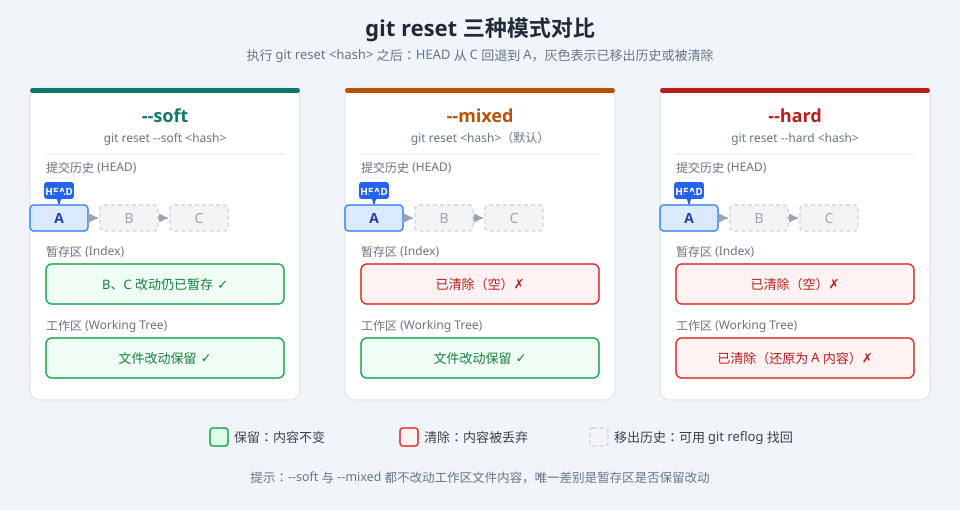

# Git 恢复与重置

## 丢弃工作区修改

丢弃工作目录中的文件的修改 （恢复到最后一次提交的状态）

```bash
# 撤销单个文件的修改
git checkout -- <file-name>

# git 2.23+ 新命令
git restore <file-name>
```

## 丢弃暂存区的暂存

```bash
# 丢弃文件在暂存区的暂存, 不影响文件在工作区变更内容
git reset HEAD <file-name>

# git 2.23+ 新命令
git restore --staged <file-name>
```

## 丢弃远程仓库的文件

```bash
# 丢弃远程仓库的文件, 并将文件添加到暂存区
git rm <file-name>

# 如果不想将文件添加到暂存区, 可以使用 --cached 参数
# 文件仍然保留在工作区
# 与Linux的rm <file-name> 类似, 只是这个命令仍保留文件在工作区
git rm --cached <file-name>
```

## 重置到指定提交点

| 模式   | 命令示例                                              | 工作区变更 | 暂存区暂存 | 提交历史变更 |
| ------ | ----------------------------------------------------- | ---------- | ---------- | ------------ |
| soft   | `git reset --soft <hash>`                             | 保留       | 保留       | 回退         |
| mixed  | `git reset --mixed <hash>`<br>`git reset <hash>`      | 保留       | 清除       | 回退         |
| hard   | `git reset --hard <hash>`                             | 清除       | 清除       | 回退         |

下图展示了三种模式对工作区、暂存区、提交历史的影响（假设 HEAD 原本在提交 C，`git reset` 后回退到 A）：



一些便捷命令: 

```bash
# 从最新的提交点开始, 回退到前一个版本
git reset --hard HEAD^
# 某些shell环境下不能够直接书写^, 需要''包裹
git reset --hard 'HEAD^'

# 从最新的提交点开始, 回退到前N个版本
git reset --hard HEAD~N
```

## 操作撤销

有的时候我们可能需要撤销一个或几个已经执行的命令操作, 例如误执行了 `git reset --hard` 之类的命令, 这个时候可以通过以下步骤来撤销操作:

1. 执行 `git reflog` 查看操作日志, 找到误操作前的提交哈希值
2. 使用 `git reset --hard <commit-hash>` 恢复到该提交
